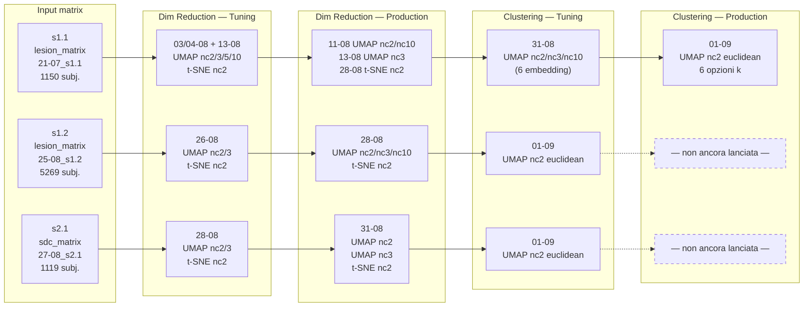

# Data Employing in Pipelines

```mermaid
flowchart LR
    classDef pending stroke-dasharray: 5 5

    subgraph COL0["Input matrix"]
        direction TB
        R11["s1.1<br/>lesion_matrix<br/>21-07_s1.1<br/>1150 subj."]
        R12["s1.2<br/>lesion_matrix<br/>25-08_s1.2<br/>5269 subj."]
        R21["s2.1<br/>sdc_matrix<br/>27-08_s2.1<br/>1119 subj."]
    end

    subgraph COL1["Dim Reduction — Tuning"]
        direction TB
        T11["03/04-08 + 13-08<br/>UMAP nc2/3/5/10<br/>t-SNE nc2"]
        T12["26-08<br/>UMAP nc2/3<br/>t-SNE nc2"]
        T21["28-08<br/>UMAP nc2/3<br/>t-SNE nc2"]
    end

    subgraph COL2["Dim Reduction — Production"]
        direction TB
        P11["11-08 UMAP nc2/nc10<br/>13-08 UMAP nc3<br/>28-08 t-SNE nc2"]
        P12["28-08<br/>UMAP nc2/nc3/nc10<br/>t-SNE nc2"]
        P21["31-08<br/>UMAP nc2<br/>UMAP nc3<br/>t-SNE nc2"]
    end

    subgraph COL3["Clustering — Tuning"]
        direction TB
        CT11["31-08<br/>UMAP nc2/nc3/nc10<br/>(6 embedding)"]
        CT12["01-09<br/>UMAP nc2 euclidean"]
        CT21["01-09<br/>UMAP nc2 euclidean"]
    end

    subgraph COL4["Clustering — Production"]
        direction TB
        CP11["01-09<br/>UMAP nc2 euclidean<br/>6 opzioni k"]
        CP12["— non ancora lanciata —"]:::pending
        CP21["— non ancora lanciata —"]:::pending
    end

    R11 --> T11 --> P11 --> CT11 --> CP11
    R12 --> T12 --> P12 --> CT12 -.-> CP12
    R21 --> T21 --> P21 --> CT21 -.-> CP21
```
