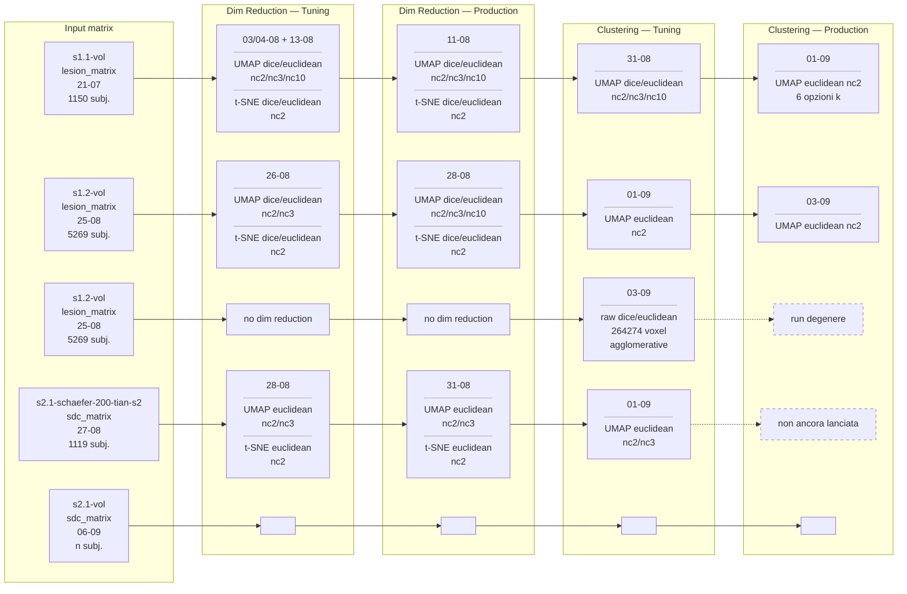

# Data Employed in Pipelines

```mermaid
flowchart LR
    classDef pending stroke-dasharray: 5 5

    subgraph COL0["Input matrix"]
        direction TB
        R11["s1.1-vol<br/>lesion_matrix<br/>21-07<br/>1150 subj."]
        R12["s1.2-vol<br/>lesion_matrix<br/>25-08<br/>5269 subj."]
        R12R["s1.2-vol<br/>lesion_matrix<br/>25-08<br/>5269 subj."]
        R21["s2.1-schaefer-200-tian-s2<br/>sdc_matrix<br/>27-08<br/>1119 subj."]
        R21V["s2.1-vol<br/>sdc_matrix<br/>06-09<br/>n subj."]
    end

    subgraph COL1["Dim Reduction — Tuning"]
        direction TB
        T11["03/04-08 + 13-08<hr/>UMAP dice/euclidean<br/>nc2/nc3/nc10<hr/>t-SNE dice/euclidean<br/>nc2"]
        T12["26-08<hr/>UMAP dice/euclidean<br/>nc2/nc3<hr/>t-SNE dice/euclidean<br/>nc2"]
        T12R["no dim reduction"]
        T21["28-08<hr/>UMAP euclidean<br/>nc2/nc3<hr/>t-SNE euclidean<br/>nc2"]
        T21V[" "]
    end

    subgraph COL2["Dim Reduction — Production"]
        direction TB
        P11["11-08<hr/>UMAP dice/euclidean<br/>nc2/nc3/nc10<hr/>t-SNE dice/euclidean<br/>nc2"]
        P12["28-08<hr/>UMAP dice/euclidean<br/>nc2/nc3/nc10<hr/>t-SNE dice/euclidean<br/>nc2"]
        P12R["no dim reduction"]
        P21["31-08<hr/>UMAP euclidean<br/>nc2/nc3<hr/>t-SNE euclidean<br/>nc2"]
        P21V[" "]
    end

    subgraph COL3["Clustering — Tuning"]
        direction TB
        CT11["31-08<hr/>UMAP dice/euclidean<br/>nc2/nc3/nc10"]
        CT12["01-09<hr/>UMAP euclidean<br/>nc2"]
        CT12R["03-09<hr/>raw dice/euclidean<br/>264274 voxel<br/>agglomerative"]
        CT21["01-09<hr/>UMAP euclidean<br/>nc2/nc3"]
        CT21V[" "]
    end

    subgraph COL4["Clustering — Production"]
        direction TB
        CP11["01-09<hr/>UMAP euclidean nc2<br/>6 opzioni k"]
        CP12["03-09<hr/>UMAP euclidean nc2<br/>"]
        CP12R["run degenere"]:::pending
        CP21["non ancora lanciata"]:::pending
        CP21V[" "]
    end

    R11 --> T11 --> P11 --> CT11 --> CP11
    R12 --> T12 --> P12 --> CT12 --> CP12
    R12R --> T12R --> P12R --> CT12R -.-> CP12R
    R21 --> T21 --> P21 --> CT21 -.-> CP21
    R21V --> T21V --> P21V --> CT21V --> CP21V
```

## Notes
The clustering that are done when the methods are not specified:

- k-means
- agglomerative
- gmm
- hdbscan
- spectral

