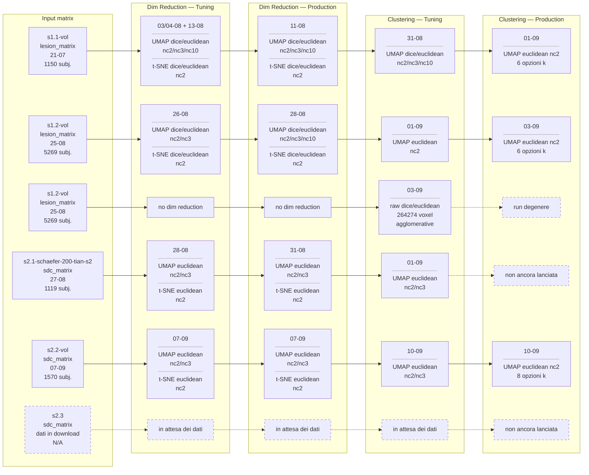

# Data Employed in Pipelines

## Notes
The clustering that are done when the methods are not specified:

- k-means
- agglomerative
- gmm
- hdbscan
- spectral

**s2.3** copre l'SDC per tutti i dataset in scope; il download dei dati è ancora in corso, quindi la sdc matrix non è ancora costruibile. Una volta completato il download: costruire la sdc matrix, poi replicare su s2.3 il resto della pipeline già percorsa per s2.2 (dim reduction tuning/produzione, clustering tuning/produzione).

