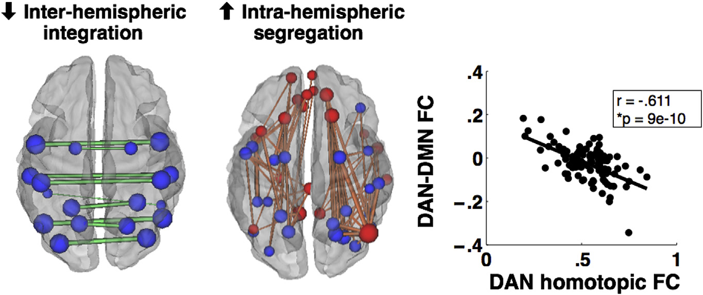

### Special issue: Review

### On the low dimensionality of behavioral deficits and alterations of brain network connectivity after focal injury

Maurizio Corbetta a,b,c,d,e,f, * , Joshua S. Siegel a and Gordon L. Shulman a

- a Department of Neurology, Washington University Saint Louis, USA
- b Department of Radiology, Washington University Saint Louis, USA
- c Department of Neuroscience, Washington University Saint Louis, USA
- d Department of Biomedical Engineering, Washington University Saint Louis, USA
- e Department of Neuroscience, University of Padova, Italy
- f Padova Neuroscience Center, University of Padova, Italy

### a r t i c l e i n f o

Article history: Received 19 May 2017 Reviewed 18 July 2017 Revised 15 December 2017 Accepted 20 December 2017 Published online 2 January 2018

Keywords: Neuropsychology Stroke Lesion-symptom mapping Functional connectivity

Brain networks

### a b s t r a c t

Traditional neuropsychological approaches emphasize the specificity of behavioral deficits and the modular organization of the brain. At the population level, however, there is emerging evidence that deficits are correlated resulting in a low dimensional structure of post-stroke neurological impairments. Here we consider the implications of low dimensionality for the three-way mapping between structural damage, altered physiology, and behavioral deficits. Understanding this mapping will be aided by large-sample studies that apply multivariate models and focus on explained percentage of variance, as opposed to univariate lesion-symptom techniques that report statistical significance. The low dimensionality of behavioral deficits following stroke is paralleled by widespread, yet relatively consistent, changes in functional connectivity (FC), including a reduction in modularity. Both are related to the structural damage to white matter and subcortical grey commonly produced by stroke. We suggest that large-scale physiological abnormalities following a stroke reduce the variety of neural states visited during task processing and at rest, resulting in a limited repertoire of behavioral states.

©

2018 The Authors. Published by Elsevier Ltd. This is an open access article under the CC BY-NC-ND license (http://creativecommons.org/licenses/by-nc-nd/4.0/).

Studies of the relationship between brain lesions and behavioral deficits have long been used to evaluate models of brain function. An important early finding from classic neurological work, in the late 1880 ' s until the mid 1900 ' s, was that lesions to different brain regions produced different behavioral deficits, suggesting that specific regions were associated with particular behavioral functions. This result was observed both for basic sensory and motor domains and for higher-order domains such as language, memory, and attention.

> * Corresponding author . Department of Neuroscience, University of Padova, Italy.

> E-mail address: maurizio.corbetta@unipd.it (M. Corbetta).

Available online at www.sciencedirect.com

### ScienceDirect

Journal homepage: www.elsevier.com/locate/cortex

As functional-anatomical models of these domains became more detailed with the emergence of cognitive science and then cognitive neuropsychology, in the 1960 ' s studies focused on patients with deficits that might distinguish between models. In one tradition, the goal was to distinguish different functional models without regard to how those models were implemented in the brain, i.e., the anatomical or functional mechanism was irrelevant. For example, neuropsychological studies sought to distinguish different models of reading (Patterson, 1981). These studies often reported analyses of single cases with highly specific behavioral deficits.

In another tradition, the focus was on both the lesion topography and the functional deficit, with the goal of testing the contribution of specific regions to specific processes within a behavioral domain. This latter goal led to the study of relatively small groupsinwhichthelesionwasrestrictedtoasingle, compact cortical location, such as the left inferior frontal gyrus in language versus task control (Thompson-Schill et al., 1998), or the intraparietal sulcus in specific attention processes (Vandenberghe et al., 2005), and detailed behavioral assessments were limited to a particular domain such as language or attention. In a further development of the latter approach, lesion-symptom mapping was applied to larger samples of patients with heterogeneous lesion topographies in order to determine the whole-brain mapping of a particular behavioral measure(Batesetal.,2003;Karnath,FruhmannBerger,Kuker, & Rorden, 2004). More recently, lesion-symptom mapping studies have been applied to less well-studied behavioral domains, such as emotions (Adolphs, Damasio, Tranel, Cooper, & Damasio, 2000), self-consciousness (Ionta et al., 2011) and intelligence (Glascher et al., 2009).

Lesion-symptom mapping studies are based on a few important assumptions. First, that there is a specific relationship between a region of the brain and a functional process or behavior. While early neurological studies thought that complex behaviors were localized in specific brain regions, later on it was suggested that simpler cognitive operations are the unit of mental organization (Posner, Petersen, Fox, & Raichle, 1988). According to this view, which is dominant in modern cognitive neuroscience and neuropsychology, complex behaviors are mediated by the activation of cognitive operations, often sequentially like in the case of processes for directing visuospatial attention (see below), and thus brain regions.

Lesions that damage specific regions or connections delete specific operations, interrupting the spatio-temporal chain of operations that support a specific behavior. Hence by using behavioral measures that isolate an elementary operation, lesion-behavior studies can identify the mapping between particular operations and specific brain regions. Perhaps the first example of this approach was the association of deficits in the putative elementary operations of disengaging, shifting, and engaging attention with damage, respectively, to the superior colliculus, pulvinar, and posterior parietal cortex (Posner, Walker, Friedrich, & Rafal, 1984). This logic was also applied to the problem of why damage to different brain regions can cause cognitive syndromes that on the surface appear similar. For example, hemi-spatial neglect is observed for strokes affecting the temporo-parietal, superior temporal, and inferior frontal cortex, as well as multiple subcortical nuclei (Husain & Kennard, 1996; Karnath, Ferber, & Himmelbach, 2001; Vallar & Perani, 1987, pp. 235 e 258). Researchers have tried to show that different sub-types of neglect, e.g., allocentric versus egocentric, or perceptual versus motor, are observed following damagetothesedifferentbrainregions(Bisiach,Geminiani,Berti, & Rusconi, 1990; Medina et al., 2008; Verdon, Schwartz, Lovblad, Hauert, & Vuilleumier, 2010). However, we have been more impressed with the similarity and correlation between different behavioral deficits that are part of the neglect syndrome than their difference (Corbetta & Shulman, 2011).

A second important assumption of lesion-symptom mapping studies is that the mapping of elementary operations/cognitive processes to single brain regions holds irrespective of the functional domain. Lesion-symptom mapping studies have been directed not only to basic sensory, motor, and cognitive functions, but also to high-level abilities such as theory of mind (Besharati et al., 2016), emotional intelligence (Hogeveen, Salvi, & Grafman, 2016), and morality (Sobhani & Bechara, 2011). However, as we will discuss later, this assumption may well be faulty, since functions may depend on flexible interactions among many brain regions. For example, we recently showed that while visual and motor impairments post-stroke are well predicted by the location of the lesion, memory and attention impairments are better predicted by functional interactions between brain regions than structural damage (Siegel et al., 2016). This contrast might apply even more strongly to high-level domains such as intelligence, social and emotional cognition. The implication is then that lesion-symptom mapping is more suited for studying sensory-motor than cognitive impairments.

A final important assumption is that a statistically significant association between a behavioral deficit and a brain voxel is sufficient to link that voxel to a specific behavior/process. Three thorny issues undermine this assumption. The first, how to control for multiple comparisons when the statistical association with behavior is tested over many voxels (typically 30 e 50 K in a structural MRI scan), is well known. Secondly, most lesion-symptom mapping studies do not report how much of the variance in behavior across subjects is accounted for by the lesion. Recent studies have emphasized predictions of behavioral variance based on features of lesions such as volume and location, allowing the importance of those features to be better assessed (Siegel et al., 2016). A final difficulty for univariate lesion-behavior techniques is how to control for the correlation among voxels induced by the natural size of strokes and their occurrence in specific vascular distributions (Mah, 2014, Brain). This factor can lead to serious mislocalization of brain-behavior associations. Multivariate techniques are particularly useful for solving this problem.

Notwithstanding the limitations highlighted above, lesionsymptom mapping studies have shaped modern ideas about human brain function. The existence of a language system (Wernicke, 1908), the role of the hippocampus in memory (Scoville & Milner, 1957), the modularity of visual cortex for object features (Damasio, Damasio, & Van Hoesen, 1982), the role of parietal (Critchley, 1953) and frontal cortex (Mesulam, 1981) in representing space and actions; all of these insights are in large part due to careful clinical description of

behavioral deficits coupled with anatomical observations, either through pathology or imaging. However, a focus on dissociations of function has perhaps overemphasized the degree to which the brain is a highly modular and segregated system, particularly following a stroke.

### Correlated behavioral deficits following stroke

Whenneurologists and neuropsychologists round on a patient ward most of what they see does not spark their interest. Most patients fit a pattern of behavioral dysfunction that is known, or apparently known. Traditional teaching emphasizes patterns of behavioral dysfunction that conform to the vascular distribution of the stroke, e.g., an anterior cerebral artery or middle cerebral artery syndrome. The research emphasis, hence publications, are on rare cases that show interesting symptoms or dissociations from the norm. This leads to the paradoxical result that our ideas on brain e behavior relationships are effectively based on the exceptions rather than the norm. But then, what is the norm?

From a purely clinical perspective, most stroke patients have behavioral deficits that are less specific than those reported in neuropsychological studies, both within a domain and even across domains. For example, as discussed below, many aphasia patients have deficits across a spectrum of language functions as well as deficits of memory and other cognitive functions. From the perspective of finding behavioral dissociations, the presence of multiple deficits is a nuisance that prevents a proper study of how strokes affect behavior. But the frequent co-occurrence of deficits within and across domains is important for both practical and theoretical reasons.

For example, let ' s consider what emerges from studies of behavioral deficits that have measured behavior across large samples of stroke patients prospectively enrolled using a relatively simple standardized neurological assessment like the National Institute of Health Stroke Scale (NIHSS). Several studies (Zandieh et al., 2012) have looked at the pattern of behavioral deficits across patients and reported two factors, one for left and one for right hemisphere lesions. Each factor is split between a motor and a cognitive component and jointly accounts for more than 80% of variability across subjects. That is, independently of the location of the lesion and hence the vascular distribution, the variability of behavioral impairment did not separate into many independent dimensions, as one might have predicted from classic neuropsychology, but instead into a low dimensional structure consistent with correlated impairments.

This limited factor structure is not a consequence of the coarse nature of the NIHSS. We recently analyzed behavioral data from a prospective sample of 132 acute stroke patients (Corbetta et al., 2015). Each patient was tested with a behavioral battery that involved assessments within the domains of language, motor, attention, visual memory and verbal memory that were much more detailed than the NIHSS. Yet most of the variance in the language, motor, verbal memory, and spatial memory domains was captured by single factors (motor impairments were coded as contralesional/ipsilesional rather than left/right).

While previous reports had highlighted that the majority of motorimpairment, in strength, coordination, range of motion, and function, both proximally and distally, can be summarized by a single 'motor ' factor (Beebe & Lang, 2009; Lang & Beebe, 2007), more surprising was the finding of single factors for functions like language, verbal and spatial memory.

The lower the score a stroke patient had on one language test, the lower the score they were likely to have on another language test. A patient may have performed more poorly on one language sub-test than another, but any selective deficit often rode on top of an overall deficit. An overall language deficit, however, may be more readily observed when stroke patients are analyzed irrespective of their deficit, rather than when only patients initially classified as aphasics are tested. When the analysis was restricted to patients with language deficits, some evidence for separate comprehension and expression factors was observed (Corbetta et al., 2015), in better agreement with traditional models. A recent analysis on a large population of aphasic patients showed a 4component structure in line with more traditional distinctions between comprehension, reading, and expression (Fong & Fucetola, in preparation). Therefore, although individual patients may have highly selective deficits within a domain, they are not representative of the stroke population. In our study of a prospective stroke sample, a single language factor accounted for 76% of variance across subjects. In the memory domain, two factors explained 66% of the variance: visuospatial memory loaded on one factor, and verbal memory loaded on a different factor. There was no clear separation between working, immediate, and delayed memory recall, and response criterion (discrimination index). The two memory factors were correlated and did not differentiate the side of the lesion. Finally, in the attention domain the analysis identified three factors that accounted for 57% of the variance. The first factor isolated a contralesional visual field bias, stronger in right hemisphere patients. The second factor isolated an overall performance (sustained attention) factor loading on low accuracy and slow reaction times, and was present in left and right hemisphere patients. The third factor was related to deficits in shifting attention.

Moreover, deficits in different domains were not independent. For example, patients with left visual field neglect also had some tendency to have motor deficits involving the left side of the body, as well as poorer spatial memory and slowed overall reaction time, while patients with language deficits were more likely to have deficits in verbal and to a lesser extent, spatial memory. Overall, only 1/3 of patients had deficits in a single domain, even though some important domains were not tested (e.g., executive function and social cognition).

At the highest level one can separate an attention-motor component, contralesional to the lesion, and a cognitive language-memory component (Corbetta et al., 2015; Ramsey et al., 2017) (Fig. 1). Interestingly, this structure matches that found with the NIHSS, even though we used 42 neuropsychological tests over 6 domains of function (motor, attention, vision, language, visual and verbal memory), which should have yielded a more granular structure of behavioral deficits.

These results point to the importance of determining the population, covariance structure of behavioral deficits. The covariance among deficits both within a domain as well as

Deficit at 2 weeks

Motor

Attention

Verbal

### Memory

Moderation on Recovery

Language

Motor

### Memory

**Figure labels:**
- Spatial
- Memory
- Attention

across domains appear to account for the majority of variance in a clinically relevant stroke population. The structure of correlation seems to be specific, and not dependent on spurious factors such as low arousal or motivation, anxiety and depression, sample size or variability in performance especially at the acute stage. Correlation among behavioural impairments was present not only acutely post-stroke (1 e 2 weeks), but also at 3 and 12 months. Moreover, the amount of variance explained at each time point was approximately the same (69% 1 e 2 weeks; 65% 3 months; 62% at 12 months) even though the sample size became smaller with time because of attrition (n ¼ 132 at 1 e 2 weeks; n ¼ 103 at 3 months; n ¼ 88 at 12 months). In addition, the variance accounted for remained stable even though in absolute terms all functions improved: language 62%, spatial memory 70%, visuospatial attention 70%, motor 58%, and verbal memory 38% (Ramsey et al., 2017). Finally, interactions between deficits influenced the amount of recovery. For instance, lower sub-acute attention scores were associated with worse language recovery (Ramsey et al., 2017). Significant interactions occurred between language and attention, spatial memory and attention, and spatial memory and motor function. Interactions were in both directions. For example, sub-acute language moderated the recovery of attention and sub-acute attention moderated the recovery of language (Fig. 1).

The stability of behavioral clusters, their ability to account for variance over time, and the pattern of moderation on recovery makes it very unlikely that they reflect non-specific variables such as vigilance, motivation, anxiety/depression, performance variability or sample size. Rather they suggest that stroke lesions at least in the clinically relevant distribution examined here (see below) cause a common low dimensional set of behavioral deficits and clusters of deficits. Moreover, it appears that there are meaningful interactions on behavioral recovery. For instance, spatial memory deficits appear to co-vary with all other domains (motor, attention, language, verbal memory), and the recovery of spatial memory asymmetrically influences the recovery of attention ad motor deficits.

Verbal

### Theoretical implications of correlated deficits

The low dimensionality of behavioural deficits post-stroke is surprising. The location of the lesions was highly heterogeneous, and a modular view of brain function might have predicted many more clusters.

The low dimensionality may reflect in part the relatively small number of patients with a specific kind of impairment, e.g., only 30% of the patients had aphasia in our sample, which is in line with the frequency of aphasia in a non-selected stroke population. This distribution tends to highlight differences between aphasics versus non-aphasics rather than differences among different aphasia subgroups. In fact, when we repeat the analysis on exclusively left hemisphere or aphasic patients, we do identify two additional components e one related to control, the other to phonology e still correlated with the overall language component (Baldassarre et al. in preparation). In addition, as mentioned above a PCA on many language tests in ~300 aphasics yields more factors, but still a fairly low number (Fong & Fucetola). In our opinion, the low dimensionality we observe both within and across domains, as well as the pattern of interaction, reflects the highest level of a nested hierarchy of correlated deficits following stroke, which is relatively independent of lesion location.

Is it possible that purer, more modular, deficits would be found, if the tests were more directed to specific processes? We think that this is unlikely. In a pioneering study of 287 stroke patients performance on a broad range of cognitive tests (putatively targeting attention and executive functions, different language, memory, praxis, motor function, affect, and number processing) was measured on the Birmingham cognitive screen (Massa, Wang, Bickerton, Demeyere, & Riddoch, 2015). In general, in all domains the degree of association between different processes within a domain was very high. Moreover, nominal assignment of specific tests to specific cognitive functions were largely invalid. For example, complex figure copying linked to tests of executive function (such as rule finding and shifting), attention (apple cancellation), praxis (multi-step object use), language (sentence reading), and the Barthel index of activities of daily living and motor function.

Hence pure dissociations almost never occur, both because of correlation of processes within/across domains, as well as because of correlation induced by the need to combine multiple processes even in simple tasks. An important challenge for the future will be to examine where cases of classic double dissociation, in which one patient fails predominantly in one or another task process, falls in the continuum of inter-subject covariance within/across domains of function. Our hypothesis would predict that these cases would be just extremes on a normal distribution of deficit association rather than outliers.

Our current hypothesis is that the correlation of behavioral deficits reflects a correlation of physiological processes that are represented in a distributed network rather than in local modules. The process correlation reflects similarities across subjects in the way tasks are performed in relation to physical constraints related to the environment, the body, and the organization of cognitive systems. This issue will be further elaborated later on when we discuss neural mechanisms.

Here we care to highlight that the need to move from a framework centered on a collection of highly specific dissociations within each domain, hence a view of highly segregated brain modules, to one of interactions across domains, hence more integrated at the neural level, was very much on Glyn Humphreys ' mind especially in his most recent work. Glyn and his collaborators in Birmingham and then Oxford developed a multi-domain assessment of behavioral impairment post-stroke that was both 'broad ' and 'shallow ' in his ownwords, allowing impairments across multiple domains to be measured in a time efficient manner (Bickerton et al., 2015; Demeyere, Riddoch, Slavkova, Bickerton, & Humphreys, 2015). The Birmingham Cognitive Screen (BcoS) which then morphed into the Oxford Cognitive Screen (OCS) has been validated in several countries (Singapore, Italy, Russia) and more recently tested in African countries (Humphreys et al., 2017).

### Practical consequences of correlated deficits

Fromapractical standpoint, the presence of correlated deficits following stroke has important implications. Because recovery needs to occur broadly over a domain rather than for a single process putatively damaged by the stroke, it is important to know how well therapies that target one function generalize to other functions within the domain. In addition, recovery in one behavioral domain may depend on the presence of deficits in other domains and this relationship may differ across domains. For example, Ramsey et al. [Ramsey, 2017 #8857] recently reported that recovery of attentionrelated deficits was negatively related to the number of deficits in other domains, with a marginal effect for spatial memory, but a similar relationship was not significant for the other tested domains. More generally, a focus on patients with very selective deficits inevitably ignores the great majority of patients with stroke, while a focus on a single behavioral domain or a particular process within a domain yields an incomplete picture of a patient ' s deficits and prognosis for recovery.

As epidemiological, genetic, and intervention studies try to capture in even more detail subgroups of patients, these behavioral phenotypes will be sensitive and appropriate measures of behavioral impairment at the population level.

### Neurological factors driving the covariance structure of stroke-induced deficits

Why do strokes produce multiple deficits that have a specific covariance structure? A traditional answer is that the covariance of deficits arises because strokes occur within vascular territories. Two behavioral processes that involve cortical regions within the same territory will tend to show correlated deficits. However, this explanation does not fully account for the covariance structure. Spatial and verbal memory deficits tend to be correlated, but each is poorly predicted by lesion topography and the lesion-based predictability that can be demonstrated tends to involve different hemispheres (Corbetta et al., 2015).

We think that the covariance structure of deficits additionally reflects two important facts about stroke. First, strokes structurally damage subcortical regions and white matter much more frequently than cortex. This important result has been shown by several analyses of representative stroke samples (Kang, Chalela, Ezzeddine, & Warach, 2003; Wessels et al., 2006). In a recent study (Corbetta et al., 2015), we showed that damage to regions of the white matter that contain a high number of fiber pathways linearly relate to the number of impaired domains of function.

A second fact, which partly follows from the first, is that the physiological effects of a stroke extend to tissue far removed from the structural damage. These physiological effects have been demonstrated using perfusion and other measures (Hillis et al., 2002), and are especially prominent in studies of blood oxygen level dependent (BOLD) functional connectivity (FC) (He et al., 2007), which measures the interregional temporal correlation of the BOLD signal typically at rest, i.e., in the absence of any overt task. 1

White matter damage impairs the communication between brain regions, which likely underlies the sensitivity of FC to stroke-induced impairment. The efficacy of cognitive processes depends on communication between multiple areas and since major, associative white matter tracts underlie this communication, it is not surprising that white matter damage involving these tracts is particularly likely to produce multiple deficits. Just as importantly, the effect of this damage propagates through the brain, with widespread changes in resting functional connectivity. Interestingly, the latter changes afford a better prediction of cognitive deficits such as attention and memory than the lesions themselves (Siegel et al., 2016). This is consistent with the fact that higherorder functions critically depend on the interactions between brain regions.

Two important points emerge from the joint analysis of how well structural and FC variables account for behavior.

> 1 BOLD FC is thought to reflect a physiological marker of structural connections, which is 'weighted ' by the amount of task-dependent activity occurring on those connections (Lewis, Baldassarre, Committeri, Romani, & Corbetta, 2009; Raichle, 2011; Wig, Schlaggar, & Petersen, 2011). In other words, regions of the brain that are commonly co-activated during behaviour will maintain a high level of correlation at rest. This hypothesis explains the high similarity between FC at rest and task-evoked activity topography at the group and individual level (Smith et al., 2009; Tavor et al., 2016); modifications of rest FC after learning novel tasks (Tambini, Ketz, & Davachi, 2010); and extensively documented correlations between individual variations in performance and resting FC (Vaidya & Gordon, 2013). In the case of lesions, the correlation between behavioural deficits and resting FC must depend on alterations of the normal patterns of synchronization among brain regions during task performance, but this relationship between resting and task FC in stroke patients has not been yet systematically evaluated.

In addition, FC-behaviour correlation in patients are prone to many artefacts including problems with the co-registration of functional data in lesioned brains; movement-related artefacts and alterations of the neuro-vascular coupling, i.e., mechanisms that allow blood vessels to dilate in response to local neuronal activity. These points are extensively discussed in a recent review in which we also provide best practice recommendations for fMRI clinical studies (Siegel, Shulman, & Corbetta, 2017).

+ Inter-hemispheric integration

1 Intra-hemispheric segregation

.4

First, different cognitive deficits are predicted by alterations of FC that involve a large number of regions. For instance, in the case of visuospatial attention deficits, nearly 50% of all brain regions show characteristic FC dysfunction (Baldassarre et al., 2014). Therefore, a large chunk of the brain sits in an abnormal state of functional connectivity, which accounts for a significant fraction of the measured behavioral deficit. Secondly, the behavioral specificity of FC alteration, e.g., for attention versus motor versus memory, is not given by the kind of FC alteration, but its topography. In fact, two phenotypes of FC dysfunction, namely a loss of inter-hemispheric correlation, and an abnormally strong intra-hemispheric correlation between regions/networks that are normally segregated, account for behavioral deficits across different domains (Baldassarre et al., 2014; Siegel et al., 2016) (Fig. 2A). What provides specificity is the topography of these changes across brain regions/networks.

In summary, the low dimensionality of behavioral deficits within/across domains is matched by a low dimensionality of correlated patterns of abnormal FC that involve widespread parts of cortex, especially for cognitive deficits. We are in the process of examining global measures of connectivity (e.g., modularity) that could become neuroimaging biomarker of injury and recovery, even at the level of single cases (Siegel, Seitzman et al., 2018).

### How do low dimensional alterations of functional connectivity relate to correlated behavioral deficits?

We propose that the low dimensionality of behavior and FC alterations following stroke reflect a decrease of the entropy of neural states that the brain generates at rest and during behavior (Adhikari et al., 2017; Saenger et al., 2017).

Recent analyses of the graph structure of inter-regional interactions have shown that at rest, most interactions occur within modular networks that have particular functional roles (e.g., the motor, default, dorsal attention networks) (Power et al., 2011; Yeo et al., 2011). A highly modular

r=-.611

network structure might seem to limit the degree to which lesion-induced deficits would be expressed in multiple domains. However, the modular network structure at rest in the healthy brain becomes less modular during task processing, which is the context in which behavioral measures are collected. Although the overall topography of functional connection is preserved during a task (Cole, Bassett, Power, Braver, & Petersen, 2014; Smith et al., 2009), which has led to the idea that rest and task connectivity patterns are highly similar, recent work indicates that performing a task significantly alters functional interactions among brain regions (Betti et al., 2013; Spadone et al., 2015; Kim, Kay, Shulman, & Corbetta, 2017).

More speculatively, a decrease in modularity during active behavior may partly reflect a strategy, mostly investigated in the motor system, for responding efficiently in a complex environment. Because of the enormous number of degrees of freedom that characterize hand movements, motor researchers have emphasized the importance of synergies that reduce dimensionality by coupling the movements of individual components (Santello, 2015; Schieber, 2004). Analyses of naturalistic hand postures indicate that only a few principal components explain large amounts of variance (Howard, Ingram, Kording, & Wolpert, 2009; Santello, 2015). These synergies are reflected in the organization of the motor system (Leo et al., 2016). In M1, for example, single neurons are not dedicated to single fingers (Schieber, 2004). Synergies, incorporated in the brain to solve the computational problem of a combinatorial explosion, naturally lead to correlated deficits, which may partly explain why we found that motor deficits in patients were largely accounted for by a single factor. Although synergies have mostly been explored within the motor domain, similar ideas may apply to other domains as well. It is possible for instance that there are 'cognitive synergies ' that represent canonical patterns of highly frequent behavior or information states, which at the same time constrain natural behavior and provide 'priors ' for its execution. An example is recent evidence that, although executive functions are often divided in different processes, each with its own neural locus, across multiple ages and populations,

executive processes are robustly correlated across subjects, and activate a common set of regions (Friedman & Miyake, 2017). Such synergy in executive processes shall manifest after lesions with correlated impairment and presumably lowdimensional patterns of abnormal connectivity.

These cognitive synergies may be reflected in canonical patterns of multi-network correlation that have consistency both in space and in time, i.e., in the temporal sequence of directional interactions. Although synergies may be most strongly observed during tasks, they may also be coded or present in resting state activity, forming a prior or scaffolding that constrains task performance.

Synergies decrease the dimensionality of neural states and the corresponding behaviors. A stroke may further decrease dimensionality by damaging connections, leading to less variability in neural and behavioral patterns. We have empirically observed that alterations in resting FC following lesions are not confined to single networks, although some specificity is observed (Nomura et al., 2010), and tend to involve a large number of brain regions (Baldassarre et al., 2014).

We think that alterations in resting FC secondary to focal injuries decrease the variability of neural states that the brain can explore both at rest and during tasks, hence the ability to process information effectively. Whole brain computational modeling is a new branch of computational neuroscience that uses realistic models of brain structural connectivity and models of local neural dynamics to analyze the emergence of global dynamic patterns (Deco, Jirsa, & McIntosh, 2011). In one study (Adhikari et al., 2017) we applied the lesions from a group of stroke patients to the model, weakening the connections of damaged cortical regions with the rest of the brain. Using measures of integration, i.e., largest cluster at multiple threshold of correlation magnitude, both empirical and model-based, and of segregation in the model, i.e., variability of patterns obtained during random sensory stimulation, we showed that lesions cause a decrement of both integration and segregation of network correlation. Importantly these measures were also related to empirical measures of FC dysfunction and behavior in the same patients. In another study (Saenger et al., 2017), we measured the entropy of brain regions (nodes) in empirical and modeled functional networks reconstructed from resting state fMRI to ask whether the variability of neural states (entropy) related to the richness of structural connections to/from that node. Overall, a strong positive correlation was found between node entropy (functional) and structure, node strength, especially. Moreover, in stroke a reduction of entropy was present not only in the damagedhemisphere, but also in the normal hemisphere, and correlated with loss of inter-hemispheric FC, the most common FC marker of stroke. Globally, information diffusion was also affected in empirical and modeled strokes compared with healthy controls. Therefore, both studies show that it is now possible to model in a computer the effect of stroke, and that FC measures in stroke relate to abnormalities of neural states with a reduction of information transfer across brain regions. In future work, it will be interesting to validate these concepts using recently developed measures of complexity obtained during non-invasive stimulation with TMS (Casali et al., 2013; Tononi, Boly, Massimini, & Koch, 2016).

### Why is the low dimensionality of behavior and FC important from a clinical standpoint?

If an injured brain is unable to generate variable neural states, and if this low variability is expressed in a low dimensional pattern of behavior and FC, then one goal of rehabilitation, including more recent neuro-stimulation approaches using TMSandtDCS,mightbetoimproveornormalizethisvariability.

Wehave recently shown that recovery of neurological function is strongly related to a normalization of FC abnormalities, specifically an improvement of modularity, which is a global measure of balanced integration/segregation (Siegel, Seitzman et al., 2018). Therefore, measures of modularity based on FC mightserveasaneurophysiologicalmarkerofrecoverytoassess the efficacy of interventions. Moreover, these measures could become the target of intervention. In other words, one could design interventions to improve brain modularity rather than behavior. These interventions might include again neurostimulation or more directly, brain-computer interfaces. Finally, in contrast to what is commonly done, our empirical data and modeling suggest that it would be difficult to take a brain from a state of low noise to a state of normal noise by just stimulating one site. The widespread nature of the changes in behaviorally relevant FC (or modularity) following a stroke indicates that multi-site stimulation protocols would likely be more effective. The appropriate paradigm could be guided by whole brain computational approaches that combine a study of local global dynamics with that of the controllability of the system from an engineering perspective (Gu et al., 2015). However, the translation of such modeling to treatment will not be easy.

### Conclusions

Neurological deficits at the population level are more correlated than one might expect from reading the neuropsychological literature. Accordingly, the multi-domain approach pioneered by Glyn Humphreys represents a new, fundamental development in neuropsychology. Understanding the complex 3-way mapping between structural damage, physiological abnormalities and behavioral deficits will be aided by studies involving large samples that are coupled to sophisticated multivariate analysistechniques.Thesestudieswillenablethedevelopment of a new functional anatomy of behavioral deficits that takes into account large-scale interactions between brain regions.

### Acknowledgments

This research was supported by RO1 NS095741 (NINDS), MH096482 (NIMH), and JTC 2017 FLAG-ERA Human Brain Project (HBP).

r e f e r e n c e s

- capacity in stroke measured by whole brain models of resting state activity. Brain, 140 (4), 1068 e 1085. https://doi.org/10.1093/ brain/awx021.

Adolphs, R., Damasio, H., Tranel, D., Cooper, G., & Damasio, A. R. (2000). A role for somatosensory cortices in the visual recognition of emotion as revealed by three-dimensional lesion mapping. The Journal of Neuroscience, 20 (7), 2683 e 2690.

Baldassarre, A., Ramsey, L., Hacker, C. L., Callejas, A., Astafiev, S. V., Metcalf, N. V., et al. (2014). Large-scale changes in network interactions as a physiological signature of spatial neglect. Brain, 137 (Pt 12), 3267 e 3283. doi: awu297 [pii] 10. 1093/ brain/awu297.

Bates, E., Wilson, S. M., Saygin, A. P., Dick, F., Sereno, M. I., Knight, R. T., et al. (2003). Voxel-based lesion-symptom mapping. Nature Neuroscience, 6 (5), 448 e 450.

Beebe, J. A., & Lang, C. E. (2009). Active range of motion predicts upper extremity function 3 months after stroke. Stroke, 40 (5), 1772 e 1779. https://doi.org/10.1161/STROKEAHA.108.536763.

Besharati, S., Forkel, S. J., Kopelman, M., Solms, M., Jenkinson, P. M., & Fotopoulou, A. (2016). Mentalizing the body: Spatial and social cognition in anosognosia for hemiplegia.

Brain, 139 (Pt 3), 971 e 985. https://doi.org/10.1093/brain/awv390. Betti, V., Della Penna, S., de Pasquale, F., Mantini, D., Marzetti, L., Romani, G. L., et al. (2013). Natural scienes viewing alters the dynamics of functional connectivity in the human brain. Neuron . doi: S0896-6273(13)00538-2 [pii] 10. 1016/ j.neuron.2013.06.022.

Bickerton, W. L., Demeyere, N., Francis, D., Kumar, V., Remoundou,M.,Balani,A.,etal.(2015).TheBCoScognitiveprofile screen: Utility and predictive value for stroke. Neuropsychology, 29 (4), 638 e 648. https://doi.org/10.1037/neu0000160.

Bisiach, E., Geminiani, G., Berti, A., & Rusconi, M. L. (1990). Perceptual and premotor factors of unilateral neglect. Neurology, 40 , 1278 e 1281.

Casali, A. G., Gosseries, O., Rosanova, M., Boly, M., Sarasso, S., Casali, K. R., et al. (2013). A theoretically based index of consciousness independent of sensory processing and behavior. Science Translational Medicine, 5 (198). https://doi.org/ 10.1126/scitranslmed.3006294, 198ra105.

Cole, M. W., Bassett, D. S., Power, J. D., Braver, T. S., & Petersen, S. E. (2014). Intrinsic and task-evoked network architectures of the human brain. Neuron, 83 (1), 238 e 251. https://doi.org/10.1016/j.neuron.2014.05.014.

Corbetta, M., Ramsey, L., Callejas, A., Baldassarre, A., Hacker, C. D., Siegel, J. S., et al. (2015). Common behavioral clusters and subcortical anatomy in stroke. Neuron, 85 (5), 927 e 941. https://doi.org/10.1016/j.neuron.2015.02.027.

Corbetta, M., & Shulman, G. L. (2011). Spatial neglect and attention networks. Annual Review of Neuroscience, 34 , 569 e 599.

https://doi.org/10.1146/annurev-neuro-061010-113731. Critchley, M. (1953). The parietal lobes . London: Edward Arnold. Damasio, A. R., Damasio, H., & Van Hoesen, G. W. (1982). Prosopagnosia: Anatomic basis and behavioral mechanisms. Neurology, 32 , 331 e 341.

Deco, G., Jirsa, V. K., & McIntosh, A. R. (2011). Emerging concepts for the dynamical organization of resting-state activity in the brain. Nature Reviews. Neuroscience, 12 (1), 43 e 56. https:// doi.org/10.1038/nrn2961.

Demeyere, N., Riddoch, M. J., Slavkova, E. D., Bickerton, W. L., & Humphreys, G. W. (2015). The Oxford cCognitive Screen (OCS): Validation of a stroke-specific short cognitive screening tool. Psychological Assessment, 27 (3), 883 e 894. https://doi.org/ 10.1037/pas0000082.

Friedman, N. P., & Miyake, A. (2017). Unity and diversity of executive functions: Individual differences as a window on cognitive structure. Cortex, 86 , 186 e 204. https://doi.org/ 10.1016/j.cortex.2016.04.023.

- Glascher, J., Tranel, D., Paul, L. K., Rudrauf, D., Rorden, C., Hornaday, A., et al. (2009). Lesion mapping of cognitive abilities linked to intelligence. Neuron, 61 (5), 681 e 691. https:// doi.org/10.1016/j.neuron.2009.01.026.

Gu, S., Pasqualetti, F., Cieslak, M., Telesford, Q. K., Yu, A. B., Kahn, A. E., et al. (2015). Controllability of structural brain networks. Nature Communications, 6 , 8414. https://doi.org/ 10.1038/ncomms9414.

He, B. J., Snyder, A. Z., Vincent, J. L., Epstein, A., Shulman, G. L., & Corbetta, M. (2007). Breakdown of functional connectivity in frontoparietal networks underlies behavioral deficits in spatial neglect. Neuron, 53 (6), 905 e 918.

Hillis, A. E., Wityk, R. J., Barker, P. B., Beauchamp, N. J., Gailloud, P., Murphy, K., et al. (2002). Subcortical aphasia and neglect in acute stroke: The role of cortical hypoperfusion. Brain, 125 (Pt 5), 1094 e 1104.

Hogeveen, J., Salvi, C., & Grafman, J. (2016). ' Emotional Intelligence ' : Lessons from lesions. Trends in Neurosciences, 39 (10), 694 e 705. https://doi.org/10.1016/j.tins.2016.08.007.

Howard, I. S., Ingram, J. N., Kording, K. P., & Wolpert, D. M. (2009). Statistics of natural movements are reflected in motor errors. Journal of Neurophysiology, 102 (3), 1902 e 1910. https://doi.org/ 10.1152/jn.00013.2009.

Humphreys, G. W., Duta, M. D., Montana, L., Demeyere, N., McCrory, C., Rohr, J., et al. (2017). Cognitive function in lowincome and low-literacy Settings: Validation of the tabletbased Oxford cognitive screen in the Health and aging in Africa: A longitudinal study of an INDEPTH community in South Africa (HAALSI). Journals of Gerontology Series B: Psychological Sciences and Social Sciences, 72 (1), 38 e 50. https:// doi.org/10.1093/geronb/gbw139.

Husain, M., & Kennard, C. (1996). Visual neglect associated with frontal lobe infarction. Journal of Neurology, 243 (9), 652 e 657.

Ionta, S., Heydrich, L., Lenggenhager, B., Mouthon, M., Fornari, E., Chapuis, D., et al. (2011). Multisensory mechanisms in temporo-parietal cortex support self-location and first-person perspective. Neuron, 70 (2), 363 e 374. https://doi.org/10.1016/ j.neuron.2011.03.009.

Kang, D. W., Chalela, J. A., Ezzeddine, M. A., & Warach, S. (2003). Association of ischemic lesion patterns on early diffusionweighted imaging with TOAST stroke subtypes. Archives of Neurology, 60 (12), 1730 e 1734. https://doi.org/10.1001/ archneur.60.12.173060/12/1730 [pii].

Karnath, H. O., Ferber, S., & Himmelbach, M. (2001). Spatial awareness is a function of the temporal not the posterior parietal lobe. Nature, 411 (6840), 950 e 953. https://doi.org/ 10.1038/35082075.

Karnath, H. O., Fruhmann Berger, M., Kuker, W., & Rorden, C. (2004). The anatomy of spatial neglect based on voxelwise statistical analysis: A study of 140 patients. Cerebral Cortex, 14 (10), 1164 e 1172.

Kim, D., Kay, K., Shulman, G. L., & Corbetta, M. (2017). A new modular brain organization of the BOLD signal during natural vision. Cerebral Cortex . https://doi.org/10.1093/cercor/bhx175.

Lang, C. E., & Beebe, J. A. (2007). Relating movement control at 9 upper extremity segments to loss of hand function in people with chronic hemiparesis. Neurorehabilitation and Neural Repair, 21 (3), 279 e 291.

Leo, A., Handjaras, G., Bianchi, M., Marino, H., Gabiccini, M., Guidi, A., et al. (2016 Feb 15). A synergy-based hand control is encoded in human motor cortical areas. Elife, 5 . pii: e13420. https://doi.org/10.7554/eLife.13420.

Lewis, C. M., Baldassarre, A., Committeri, G., Romani, G. L., & Corbetta, M. (2009). Learning sculpts the spontaneous activity of the resting human brain. Proceedings of the National Academy of Sciences USA, 106 (41), 17558 e 17563. doi: 0902455106 [pii] 10. 1073/pnas.0902455106.

Massa, M. S., Wang, N., Bickerton, W. L., Demeyere, N., Riddoch, M. J., & Humphreys, G. W. (2015 Oct). On the importance of cognitive profiling: A graphical modelling analysis of domain-specific and domain-general deficits after stroke. Cortex, 71 , 190 e 204. https://doi.org/10.1016/j.cortex. 2015.06.006. Epub 2015 Jun 23.

Medina, J., Kannan, V., Pawlak, M. A., Kleinman, J. T., Newhart, M., Davis, C., et al. (2008). Neural substrates of visuospatial processing in distinct reference frames: Evidence from unilateral spatial neglect. Journal of Cognitive Neuroscience, 21 (11), 2073 e 2084. https://doi.org/10.1162/jocn.2008.21160.

Mesulam, M. M. (1981). A cortical network for directed attention and unilateral neglect. Annals of Neurology, 10 , 309 e 315.

Nomura, E. M., Gratton, C., Visser, R. M., Kayser, A., Perez, F., & D ' Esposito, M. (2010). Double dissociation of two cognitive control networks in patients with focal brain lesions. Proc Natl Acad Sci U S A, 107 (26), 12017 e 12022. doi: 1002431107 [pii]10. 1073/pnas.1002431107.

Patterson, K. E. (1981). Neuropsychological approaches to the study of reading. British Journal of Psychology, 72 , 151 e 174.

Posner, M. I., Petersen, S. E., Fox, P. T., & Raichle, M. E. (1988). Localization of cognitive operations in the human brain. Science, 240 , 1627 e 1631.

Posner, M. I., Walker, J. A., Friedrich, F. J., & Rafal, R. D. (1984). Effects of parietal injury on covert orienting of attention. Journal of Neuroscience, 4 (7), 1863 e 1874.

Power, J. D., Cohen, A. L., Nelson, S. M., Wig, G. S., Barnes, K. A., Church, J. A., et al. (2011). Functional network organization of the human brain. Neuron, 72 (4), 665 e 678. doi: S0896-6273(11) 00792-6 [pii] 10. 1016/j.neuron.2011.09.006.

Raichle, M. E. (2011). The restless brain. Brain Connectivity, 1 (1), 3 e 12. https://doi.org/10.1089/brain.2011.0019.

Ramsey, L., Siegel, J. S., Lang, C. E., Strube, M., Shulman, G. L., & Corbetta, M. (2017). Behavioural clusters and predictors of performance during recovery from stroke. Nature Human Behaviour, 1 , 0038. doi: 0010.1038/s41562-41016-40038.

Saenger, V. M., Ponce-Alvarez, A., Adhikari, M., Hagmann, P., Deco, G., & Corbetta, M. (2017). Linking entropy at rest with the underlying structural connectivity in the healthy and lesioned brain. Cerebral Cortex , 1 e 11. https://doi.org/10.1093/cercor/ bhx176.

Santello, M. (2015). Getting a grasp of theories of sensorimotor control of the hand: Identification of underlying neural mechanisms. Motor Control, 19 (2), 149 e 153. https://doi.org/ 10.1123/mc.2014-0057.

Schieber, M. H. (2004). Motor control: Basic units of cortical output? Current Biology: CB, 14 (9), R353 e R354. https://doi.org/ 10.1016/j.cub.2004.04.025.

Scoville, W. B., & Milner, B. (1957). Loss of recent memory after bilateral hippocampal lesions. Journal of Neurology, Neurosurgery, and Psychiatry, 20 , 11 e 21.

Siegel, J. S., Ramsey, L. E., Snyder, A. Z., Metcalf, N. V., Chacko, R. V., Weinberger, K., et al. (2016). Disruptions of network connectivity predict impairment in multiple behavioral domains after stroke. Proceedings of the National Academy of Sciences USA . https://doi.org/10.1073/ pnas.1521083113.

Siegel, J. S., Shulman, G. L., & Corbetta, M. (2017). Measuring functional connectivity in stroke: Approaches and considerations. Journal of Cerebral Blood Flow & Metabolism, 37 (8), 2665 e 2678. https://doi.org/10.1177/0271678X17709198.

Siegel, J. S., Seitzman, B. A., Ramsey, L. E., Ortega, M., Gordon, E. M., Dosenbach, N. U. F., et al. (2018). Re-emergence of modular brain networks in stroke recovery. Cortex, 101 , 44 e 59.

Smith, S. M., Fox, P. T., Miller, K. L., Glahn, D. C., Fox, P. M., Mackay, C. E., et al. (2009). Correspondence of the brain ' s functional architecture during activation and rest. Proceedings of the National Academy of Sciences USA, 106 (31), 13040 e 13045. doi: 0905267106 [pii] 10.1073/pnas.0905267106.

Sobhani, M., & Bechara, A. (2011). A somatic marker perspective of immoral and corrupt behavior. Social Neuroscience, 6 (5 e 6), 640 e 652. https://doi.org/10.1080/17470919.2011.605592.

Spadone, S., Della Penna, S., Sestieri, C., Betti, V., Tosoni, A., Perrucci, M. G., et al. (2015). Dynamic reorganization of human resting-state networks during visuospatial attention. Proceedings of the National Academy of Sciences USA, 112 (26), 8112 e 8117. https://doi.org/10.1073/pnas.1415439112.

Tambini, A., Ketz, N., & Davachi, L. (2010). Enhanced brain correlations during rest are related to memory for recent experiences. Neuron, 65 (2), 280 e 290. doi: S0896-6273(10)000061 [pii] 10. 1016/j.neuron.2010.01.001.

Tavor, I., Parker Jones, O., Mars, R. B., Smith, S. M., Behrens, T. E., & Jbabdi, S. (2016). Task-free MRI predicts individual differences in brain activity during task performance. Science, 352 (6282), 216 e 220. https://doi.org/10.1126/science.aad8127.

Thompson-Schill, S. L., Swick, D., Farah, M. J., D ' Esposito, M., Kan, I. P., & Knight, R. T. (1998). Verb generation in patients with focal frontal lesions: A neuropsychological test of neuroimaging findings. Proceedings of the National Academy of Sciences, USA, 22 , 15855 e 15860.

Tononi, G., Boly, M., Massimini, M., & Koch, C. (2016). Integrated information theory: From consciousness to its physical substrate. Nature Reviews Neuroscience, 17 (7), 450 e 461. https:// doi.org/10.1038/nrn.2016.44.

Vaidya, C. J., & Gordon, E. M. (2013). Phenotypic variability in resting-state functional connectivity: Current status. Brain Connectivity, 3 (2), 99 e 120. https://doi.org/10.1089/ brain.2012.0110.

Vallar, G., & Perani, D. (1987). The anatomy of spatial neglect in humans. In M. Jeannerod (Ed.), Neurophysiological and neuropsychological aspects of spatial neglect (pp. 235 e 258). NorthHolland: Elsevier Science Publishers.

Vandenberghe, R., Geeraerts, S., Molenberghs, P., Lafosse, C., Vandenbulcke, M., Peeters, K., et al. (2005). Attentional responses to unattended stimuli in human parietal cortex. Brain, 128 (Pt 12), 2843 e 2857. doi: awh522 [pii] 10.1093/brain/ awh522.

Verdon, V., Schwartz, S., Lovblad, K. O., Hauert, C. A., & Vuilleumier, P. (2010). Neuroanatomy of hemispatial neglect and its functional components: A study using voxel-based lesion-symptom mapping. Brain, 133 (Pt 3), 880 e 894. doi: awp305 [pii] 10. 1093/brain/awp.305.

Wernicke, K. (1908). The symptom complex of aphasia. In E. D. Church (Ed.), Modern clinical medicine: Diseases of the nervous system . New York: Appleton-Century-Crofts.

Wessels, T., Wessels, C., Ellsiepen, A., Reuter, I., Trittmacher, S., Stolz, E., et al. (2006). Contribution of diffusion-weighted imaging in determination of stroke etiology. AJNR. American Journal of Neuroradiology, 27 (1), 35 e 39. doi: 27/1/35 [pii].

Wig, G. S., Schlaggar, B. L., & Petersen, S. E. (2011). Concepts and principles in the analysis of brain networks. Annals of the New York Academy of Sciences, 1224 , 126 e 146. https://doi.org/ 10.1111/j.1749-6632.2010.05947.x.

Yeo, B. T., Krienen, F. M., Sepulcre, J., Sabuncu, M. R., Lashkari, D., Hollinshead, M., et al. (2011). The organization of the human cerebral cortex estimated by intrinsic functional connectivity. Journal of Neurophysiology, 106 (3), 1125 e 1165. doi: jn.00338.2011 [pii]10. 1152/jn.00338.2011.

Zandieh, A., Kahaki, Z. Z., Sadeghian, H., Pourashraf, M., Parviz, S., Ghaffarpour, M., et al. (2012). The underlying factor structure of national institutes of Health stroke scale: An exploratory factor analysis. International Journal of Neuroscience, 122 (3), 140 e 144. https://doi.org/10.3109/00207454.2011.633721.