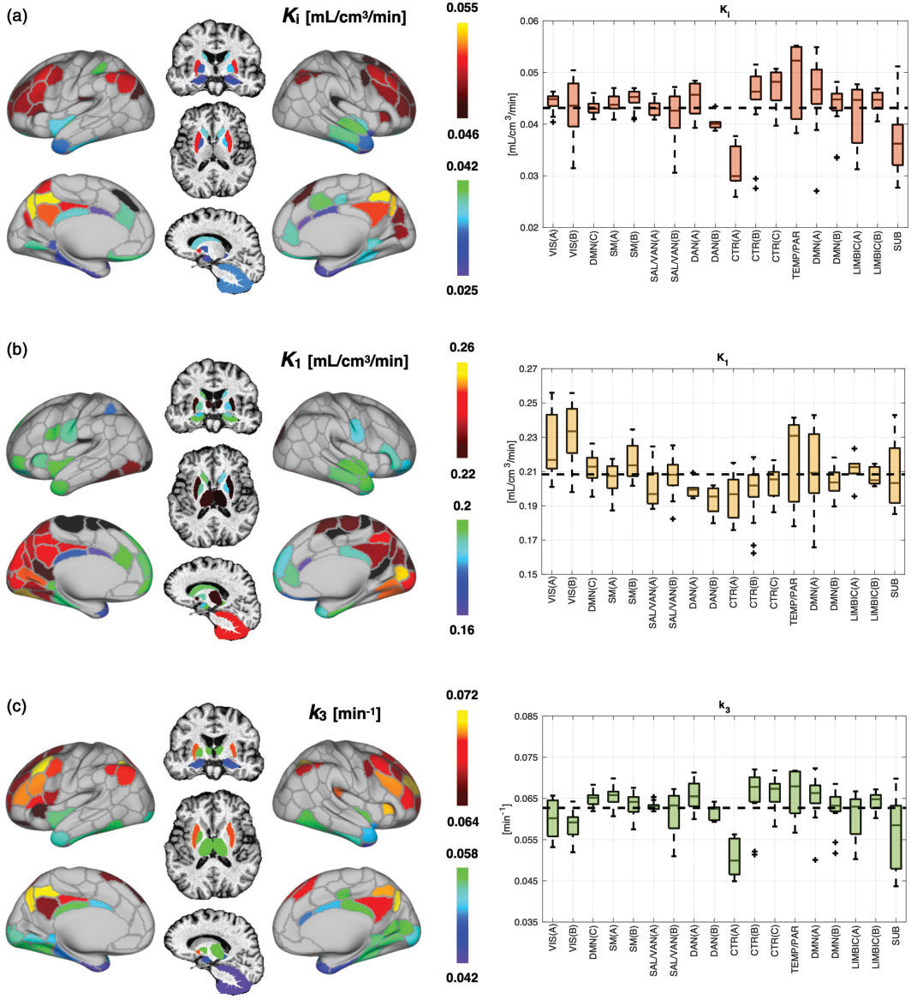

### The brain's 'dark energy' puzzle upgraded : [ 18 F]FDG uptake, delivery and phosphorylation, and their coupling with resting-state brain activity

Tommaso Volpi 1,2 , John J Lee 3 , Andrei G Vlassenko 3 , Manu S Goyal 3 , Maurizio Corbetta 2,4 and Alessandra Bertoldo 2,5

### Abstract

The brain's resting-state energy consumption is expected to be driven by spontaneous activity. We previously used 50 resting-state fMRI (rs-fMRI) features to predict [ 18 F]FDG SUVR as a proxy of glucose metabolism. Here, we expanded on our effort by estimating [ 18 F]FDG kinetic parameters K i (irreversible uptake), K 1 (delivery), k 3 (phosphorylation) in a large healthy control group (n ¼ 47). Describing the parameters' spatial distribution at high resolution (216 regions), we showed that K 1 is the least redundant (strong posteromedial pattern), and K i and k 3 have relevant differences (occipital cortices, cerebellum, thalamus). Using multilevel modeling, we investigated how much spatial variance of [ 18 F]FDG parameters could be explained by a combination of a) rs-fMRI variables, b) cerebral blood flow (CBF) and metabolic rate of oxygen (CMRO2) from 15 O PET. Rs-fMRI-only models explained part of the individual variance in K i (35%), K 1 (14%), k 3 (21%), while combining rs-fMRI and CMRO2 led to satisfactory description of K i (46%) especially. K i was sensitive to both local rs-fMRI variables ( ReHo ) and CMRO2, k 3 to ReHo , K 1 to CMRO2. This work represents a comprehensive assessment of the complex underpinnings of brain glucose consumption, and highlights links between 1) glucose phosphorylation and local brain activity, 2) glucose delivery and oxygen consumption.

### Keywords

Brain glucose metabolism, kinetic modeling, microparameters, spontaneous activity, multilevel modeling

Received 9 October 2024; Revised 1 March 2025; Accepted 9 March 2025

### Introduction

The complex interplay between the brain's metabolic rate of glucose (CMRglc) and oxygen (CMRO2), cerebral blood flow (CBF), and brain activity has long been the subject of investigation. 1-3 One of the most intriguing findings in neuroscience was the key role that spontaneous activity plays in the context of neural metabolism, as most glucose and oxygen delivered to the brain go to supply its functional needs during rest. 4,5

One would thus expect a coupling between indices of brain metabolism (CMRglc, CMRO2), blood flow, and resting-state brain activity. A moderate-to-strong association between resting-state CMRglc, CMRO2 and CBF has been demonstrated by PET studies using [ 18 F]FDG, [ 15 O]H2O, and [ 15 O]O2 tracers. 6,7 A growing number of studies have also tested the coupling between brain glucose metabolism and measures of

*[picture on PDF page 1]*

Journal of Cerebral Blood Flow & Metabolism 2025, Vol. 45(9) 1799-1815 ! The Author(s) 2025 Article reuse guidelines: sagepub.com/journals-permissions DOI: 10.1177/0271678X251329707 journals.sagepub.com/home/jcbfm

*[picture on PDF page 1]*

spontaneous activity obtained from resting-state blood oxygen level dependent (BOLD) functional MRI (rs-fMRI): 8 complex associations were detected,

> 1 Department of Radiology and Biomedical Imaging, Yale University School of Medicine, New Haven, CT, USA

> 2 Padova Neuroscience Center, University of Padova, Padova, Italy

> 3 Neuroimaging Laboratories at the Mallinckrodt Institute of Radiology,

> Washington University School of Medicine, St Louis, MO, USA

> 4 Department of Neuroscience, University of Padova, Padova, Italy

> 5 Department of Information Engineering, University of Padova, Padova, Italy

### Corresponding authors:

Tommaso Volpi, 801 Howard Ave, 06519 New Haven, CT, USA. Email: tommaso.volpi@yale.edu

Alessandra Bertoldo, Via Gradenigo 6/B, 35122 Padova, Italy. Email: alessandra.bertoldo@unipd.it

with stronger coupling between [ 18 F]FDG and local indices of BOLD activity/synchronization, and marked between-individual variability in association strength. 7,9-11

In our previous work, 11 we explored the link between the spatial topography of glucose metabolism, as measured via [ 18 F]FDG PET, and a variety of rs-fMRI measures, attempting to capture the complexity of brain metabolism through a multifaceted assessment of spontaneous activity. As in most research works, 7,10 we employed a semi-quantitative measure of [ 18 F]FDG uptake, i.e., the standardized uptake value ratio (SUVR). While this was validated as a reliable index of glucose consumption in the healthy brain, it gives a simplified view of the physiological events [ 18 F]FDG PET can track: this tracer, if combined with compartment modeling, can be used to separately estimate delivery ( K 1 ) across the blood-brain barrier (BBB) mediated by glucose transporters (GLUT1, GLUT3), 12 clearance into venous blood ( k 2), and phosphorylation rate by hexokinase ( k 3). These microparameters ( K 1 , k 2 , k 3) complement and enrich the picture given by the irreversible [ 18 F]FDG uptake rate ( K i ¼ K 1 k 3 /( k 2 þ k 3)), which is a composite macroparameter. 13 K 1 is an expression of both CBF and the tracer's extraction fraction E ( K 1 ¼ CBF /C1 E ¼ CBF /C1 1 /C0 e /C0 PS CBF ð Þ ), and thus BBB permeability (PS: permeability-surface product). 14 k 3 represents glucose phosphorylation, which is the rate limiting step for glucose utilization, and thus of particular physiological and pathological relevance; 15,16 k 3 should be strongly related to K i, making K i a good proxy of glucose phosphorylation events, but there are regions where removing the impact of delivery on K i may prove relevant. The spatial distribution of the microparameters was investigated in the 1980's, 17 and in few other works, 16,18 but a more fine-grained evaluation is warranted, especially if we want to address open questions on the link between neural metabolism and spontaneous activity.

In this work, we fully explored the physiological information provided by dynamic [ 18 F]FDG PET data in a large healthy control dataset (n ¼ 47), expanding upon our previous study, where we showed that rs-fMRI measures can explain a moderate portion of regional SUVR variability, mainly driven by local rs-fMRI features (with a significant amount of variance remaining unexplained). 11 We evaluated the spatial distribution of [ 18 F]FDG K i , K 1 , and k 3 , and related them to a multitude of potential rs-fMRI predictors (Table 1), divided into four pools: 11 1) signal , 2) hemodynamic response function ( HRF ), 19 3) static functional connectivity ( sFC ), 20 4) time-varying functional connectivity ( tvFC ). 21 We also related K i , K 1 , k 3 to CBF and CMRO2, as estimated from [ 15 O]H2O, [ 15 O]O2 PET, which more directly reflect hemodynamics and

***Table 1. Extracted rs-fMRI features and their categories.***

| Pools | rs-fMRI variables |
|---|---|
| Signal | med-BOLD : median of the BOLD time series 41 MAD - BOLD : median absolute deviation (MAD) of the BOLD time series 71 skew-BOLD : skewness of the BOLD time series 72 ApEn-BOLD : approximate entropy (ApEn) of the BOLD time series 40 rApEn-BOLD : range ApEn of the BOLD time series 73 AR-BOLD : reflection coefficient of the first-order autoregressive AR(1) model fit to BOLD time series 73 ALFF : amplitude of low frequency fluctuations (ALFF) of BOLD time series 41 ReHo : regional homogeneity of BOLD time series 42 MAD-ReHo : MAD of the time-varying ReHo (tvReHo) 74 CV-ReHo : percent coefficient of variation of tvReHo 74 |
| HRF | peaks-BOLD : number of BOLD pseudo-events peak-HRF : height of HRF peak 19 hrf-DEG : degree (DEG) of HRF correlation matrix [ original metric ] hrf-STR : strength (STR) of HRF correlation matrix [ original metric ] hrf-CC : clustering coefficient (CC) of HRF correla- tion matrix [ original metric ] hrf-BC : betweenness centrality (BC) of HRF cor- relation matrix [ original metric ] hrf-EC : eigenvector centrality (EC) of HRF corre- lation matrix [ original metric ] hrf-LE : local efficiency (LE) of HRF correlation matrix [ original metric ] hrf-GE : global efficiency (GE) of HRF correlation matrix [ original metric ] s-DEG : DEG of sFC 45 |
| sFC | s-STR : STR of sFC 45 s-CC : CC of sFC 45 s-BC : BC of sFC 45 s-EC : EC of sFC 45 s-LE : LE of sFC 45 s-GE : GE of sFC 45 med-LEig : median of the Leading Eigenvector |
| tvFC | mdiff-DEG : temporal median of the differentials (mdiff) of DEG time series [ original metric ] mdiff-STR : mdiff of STR time series [ original metric ] mdiff-CC : mdiff of CC time series [ original metric ] mdiff-BC : diff of BC time series [ original metric ] mdiff-EC : mdiff of EC time series [ original metric ] mdiff-LE : mdiff of LE time series [ original metric ] mdiff-GE : mdiff of GE time series [ original metric ] CV-DEG : coefficient of variation of DEG time series 75 CV-STR : percent coefficient of variation of STR time series 75 |

***Table 1. Continued***

| Pools | rs-fMRI variables |
|---|---|
|   | CV-CC : percent coefficient of variation of CC time series 75 CV-BC : percent coefficient of variation of BC time series 75 CV-EC : percent coefficient of variation of EC time series 75 CV-LE : percent coefficient of variation of LE time series 75 CV-GE: percent coefficient of variation of GE time series 75 SampEn-DEG : sample entropy (SampEn) of DEG time series 76 SampEn-STR : SampEn of STR time series 76 SampEn-CC : SampEn of CC time series 76 SampEn-BC : SampEn of BC time series 76 SampEn-LE : SampEn of LE time series 76 SampEn-GE : SampEn of GE time series 76 MAD-LEig : MAD of LEig time series 46 CV-LEig : percent coefficient of variation of LEig time series 46 |
|   | mdiff-LEig : mdiff of LEig time series 46 |

Fifty fMRI-derived variables, divided according to the pool to which they belong: 1) signal, 2) hemodynamic response function (HRF), 3) static functional connectivity (sFC), 4) time-varying functional connectivity (tvFC). See Supplemental Methods for full description of the features.

oxidative metabolism. 22 The main aims driving our analyses were:

- assessing the spatial distribution of [ 18 F]FDG kinetic parameters in healthy brains, with particular focus on K 1 and k 3, assuming they would provide unique information;
- evaluating differences among [ 18 F]FDG kinetic parameters in their spatial coupling with rs-fMRI measures, employing multivariable mixed-effects modeling (MEM), with the same features chosen for our SUVR model 11 to test their reproducibility and generalizability;
- evaluating whether including CBF and CMRO2 into the fMRI-based description of [ 18 F]FDG kinetic parameters could lead to a satisfactory description of glucose metabolism in its entirety.

The main scheme of the analysis is reported in Figure 1.

### Materials and methods

### Participants and imaging protocols

The dataset includes 47 healthy participants (22 F; 57.4 /C6 14.8 years) from the Adult Metabolism & Brain Resilience study. 23 Imaging procedures were approved by Human Research Protection Office and

Radioactive Drug Research Committee at Washington University in Saint Louis. T1w and rs-fMRI (TR/ TE ¼ 800/33 ms, 2.4 mm isotropic, multiband factor 6) were acquired on a Siemens Prisma fit scanner. Eyesclosed [ 18 F]FDG (60min), [ 15 O]H2O (3min), [ 15 O]O2 (3 min) PET acquisitions were performed in a single session on a Siemens ECAT EXACT HR þ . MRI scans were performed on the same day as PET for all but 5 participants.

All studies were conducted according to the principles outlined in the Declaration of Helsinki. All participants provided written consent. Details are reported in Supplemental Methods and in. 23

### PET kinetic modeling

Dynamic [ 18 F]FDG data were motion-corrected. 24 For kinetic modeling, image-derived input functions (IDIF) were extracted from dynamic PET data using a semiautomatic pipeline 25 including 1) carotid segmentation; 2) 'hot voxel' selection within the mask; 3) parametric clustering 26 to derive raw IDIF; 4) IDIF fitting; 5) Chen's spillover correction 27 using three late venous samples. Voxel-wise estimation of Sokoloff's irreversible two-tissue compartment model parameters 13 (including the blood volume fraction V b 28 ) was performed using a variational Bayesian approach: 29 1) k-means clustering applied to dynamic data to extract 6 gray matter (GM) and 5 white matter (WM) clusters (based on T1w tissue segmentations), 2) weighted nonlinear least squares estimation of kinetic parameters at the cluster level, 3) voxel-wise estimation with variational Bayesian inference based on prior distributions from cluster-wise estimates. 30 Parametric maps of K 1 (delivery, [mL/cm 3 /min]), k 2 (clearance, [min /C0 1 ]), k 3 (phosphorylation, [min /C0 1 ]), V b [%] (blood volume fraction) were obtained for each individual. Parametric maps of K i (irreversible tracer uptake, [mL/cm 3 /min]) were obtained as K i ¼ K 1 k 3 /( k 2 þ k 3 ).

Dynamic [ 15 O]H2O data and [ 15 O]O2 were used to generate relative estimates of CBF and CMRO2 31,32 (Supplemental Methods).

All parametric maps were parcellated into 216 regions (Schaefer atlas, 33 plus 16 subcortical regions 34 ) by averaging over voxels within the GM segmentation (probability > 0.8 of belonging to GM).

PET partial volume correction (PVC) was not performed: using the GM tissue segmentation and avoiding spatial smoothing during processing minimizes partial volume effects (PVE), 35 as suggested in recent work. 36 Moreover, there is no gold standard for PVC, particularly in dynamic PET studies, as this procedure is known to affect kinetic modeling accuracy and potentially alter spatial patterns of parameters. 37

Details are reported in Supplemental Methods.

Resting-state fMRI

Signal

Hemodynamic response function (HRF)

Static FC (sFC)

Time-varying FC (tvFC)

[18F]FDG PET

t2

t3

150 PET

![Figure 1. Flowchart of the analysis. The rs-fMRI data ( left ) were used to extract fifty features representative of four 'pools', i.e., 1) signal and local measures, 2) hemodynamic response function ( HRF ), 3) static functional connectivity ( sFC ), 4) time-varying functional connectivity ( tvFC ), which were parceled into 216 ROIs. [ 18 F]FDG dynamic PET data ( center ) were fitted with an irreversible twotissue compartment model to obtain voxel-wise estimates of [ 18 F]FDG kinetic parameters (most importantly, for the purpose of the analyses, K i , K 1 and k 3), which were also parceled. [ 15 O]H2O and [ 15 O]O2 dynamic PET data ( top right ) were quantified using a reversible one-tissue compartment model to obtain estimates of CBF and CMRO2, which were also parceled. The spatial coupling across ROIs between predictors (a) rs-fMRI features, b) CBF and CMRO2) - marked in red , and outcomes ([ 18 F]FDG kinetic parameters K i , K 1 and k 3) - marked in green , was investigated on two levels, i.e., at group-average level ( three-persons icon ) and at individual level ( one-person icon ) via bivariate correlation and multivariable multilevel modeling.](figures/img_p004_0.png)

**Figure labels:**
- Compartment
- modeling
- Cp
- [ml/cm//min]
- K,
- [ml/cm ¾/min]
- kg
- [min-']
- Bivariate Correlation
- &
- Multivariable Multilevel
- Modeling
- K.
- k2
- CBF
- [ml/cm3/min]
- CMRO2

### Resting-state fMRI processing and feature extraction

rs-fMRI preprocessing included slice-timing correction, nuisance regression, 38 high-pass filtering (cutoff ¼ 0.008 Hz). Additional motion correction was adapted to the rs-fMRI features (i.e., despiking for tvFC, HRF, and other time-varying measures, and volume censoring for sFC and static measures 39 ) BOLD signals were also parcellated into 216 GMmasked regions.

As in, 11 fifty rs-fMRI features, chosen to describe different aspects of the BOLD 1) signal , 2) HRF , 3) sFC , 4) tvFC (Table 1), were obtained in each participant.

The signal pool (1) includes the basic statistics of BOLD time series (temporal median, variance, skewness), its complexity/entropy, 40 low-frequency fluctuations ( ALFF ), 41 local coherence ( ReHo ) 42 and highamplitude events ( peaks-BOLD ). The HRF pool (2) relates to the HRF, 19 which links the BOLD signal to neural activity, 43 and includes HRF peak amplitude (potential proxy for CBF 44 ) and the correlations between HRF time series of different regions, which we introduced in 11 to describe 'purely vascular' networks, summarized at the region level by means of graph properties, as in traditional FC studies. 45 In the sFC pool (3) the same region-wise graph metrics

are employed to characterize sFC, i.e., FC across the entire fMRI scan. The tvFC pool (4) describes the temporal variability of graph metrics across sliding windows. 21 sFC and tvFC were characterized both as the correlation between signal magnitudes , and as the coherence of their phases. 46 This wide range of functional metrics were selected to represent most known properties of the rs-fMRI signal and its FC. See Supplemental Methods for details.

### The spatial distribution of [ 18 F]FDG kinetic parameters

To investigate the spatial distribution of K i , K 1 and k 3 , group-average ROI values were calculated, and grouped into Schaefer's 17 functional networks. 33 The top and bottom 20% values for each parameter were identified as 'high' and 'low'. Acrossregion Pearson's correlations (p < 0.05) between the three groupaveraged parameters were computed. Linear regression models ( K i as predictor, K 1 or k 3 as outcomes) were estimated and their weighted residuals visualized to assess regional mismatches between parameters.

### Bivariate associations between [ 18 F]FDG parameters and functional features

The spatial relationships between [ 18 F]FDG kinetic parameters and A) rs-fMRI properties, B) CBF and CMRO2, were assessed at group level (group-average ROI values for each feature). After testing all variables for normality (p > 0.05, Shapiro-Wilk test 47 ), bivariate associations across ROIs were evaluated via Pearson's correlation (p < 0.05). Differences between [ 18 F]FDG parameters in their spatial correlation with rs-fMRI properties, CBF and CMRO2 were tested using Steiger's z-test for dependent correlations with one variable in common (p < 0.05). 48 The average and variability (mean /C6 SD) of the squared values of [ 18 F]FDG vs. rs-fMRI correlations (R 2 ) were computed, as indices of the total strength of functional-metabolic spatial association across fMRI variables. Differences among [ 18 F] FDG parameters (factor 1) and groups of rs-fMRI features (factor 2) in [ 18 F]FDG vs. fMRI R 2 were assessed with two-way analysis of variance (ANOVA) with unbalanced design -[ 18 F]FDG parameters as first factor (3 levels: K i , K 1 , k 3 ), rs-fMRI 'clusters' as second factor (4 levels: signal, HRF, sFC, tvFC). Statistical differences between pairs of means were determined using Tukey-Kramer's multiple comparison test.

As in, 11 the spatial heterogeneity in [ 18 F]FDG-fMRI relationships was probed by assessing Pearson's correlations iteratively across clusters of regions with increasingly high (1 st ! 85 th percentiles) or low

(100 th ! 15 th percentiles) K i , K 1 or k 3 . Bivariate [ 18 F] FDG vs. rs-fMRI relationships underwent model selection between 1) linear, 2) mono-exponential, 3) power law candidate models. See Supplemental Methods for details.

### Group-level multivariable modeling of the functional-metabolic relationship

At group-average level, we used multilinear regression to assess the proportion of group-average [ 18 F]FDG K i , K 1 and k 3 spatial variance which could be explained by a linear combination of predictors, i.e., rs-fMRI variables and/or CBF, CMRO2. Predictors and outcome were centered and scaled by their standard deviation (SD) across brain regions, and log-transformed, as in, 11 to account for nonlinearities (Supplemental Results).

Rather than performing a new feature selection for each kinetic parameter (Supplemental Results), we tested whether the predictors selected for SUVR 11 would generalize to K i , K 1 and k 3 : specifically, we considered both the full SUVR model (9-parameter model, 9p) and its parsimonious version (3-parameter model, 3p). 11 The model coefficients were re-estimated. The tested models were evaluated in terms of number of predictors, adjusted R-squared (R 2 adj ), and estimate precision (i.e., percent estimation error divided by estimated value, or coefficient of variation, CV). 'Adapted' versions of the 9p model were generated by excluding predictors whose estimates had CV > 100%. To assess multicollinearity, we examined correlations among predictors, the condition number j X ð Þ of selected features, and variance inflation factors. 49

As a second step, the addition of CBF or CMRO2 to the fMRI-based models was evaluated (R 2 adj, CV).

### Full hierarchical modeling of [ 18 F]FDG kinetic parameters

As in, 11 full mixed-effects modeling (MEM) was implemented to characterize in a single stage both fixed effects h and random effects g contributing to the relationship between [ 18 F]FDG parameters and the selected predictors. 50 The individual -level model is:

yi ¼ Fi ð Xi ; w i Þ zi ¼ yi þ vi

with yi as the K i , K 1 or k 3 prediction for the i th individual ( i ¼ 1 ; . . . ; m ), which is a function of Xi ð fixed-effects design matrix), and of parameters w i to be estimated; zi is the vector K i , K 1 or k 3, and vi is within-individual variability , assumed to be normally

distributed with zero mean and variance r 2 i . The population -level model describes w i by combining the population parameters h and the random variability of individual parameters around the population mean g i :

w i ¼ h þ g i g i /C24 N 0 ; X ð Þ

where g i is normally distributed with zero mean, independent across individuals and with full covariance matrix X . The previously selected features were included in the first-level model, i.e., either rs-fMRI features only, or including CBF or CMRO2 (z-scored within individuals). The overall and individual multilevel model R 2 adj were calculated, considering the pooled data of all participants (R 2 pooled ) and the individual data (R 2 i ), respectively. The average residual unexplained variability ( avg. wres ) was evaluated. The areas with higher positive ([0.5;1.5]) or negative ([ /C0 1.5; /C0 0.5]) avg. wres were visualized to highlight where the model under- or over-estimates the outcome variable. When available, participant-specific covariates (age, sex, height, weight, body-mass index (BMI), body-surface area (BSA), insulin plasma levels) were related to R 2 i via Pearson's correlations (p < 0.05). For details, see Supplemental Methods.

### Results

The spatial distribution of [ 18 F]FDG uptake, delivery and phosphorylation rates

The group-average K i , K 1 , k 3 maps are reported in Figure 2. Group-average k 2 and V b, as well as CBF and CMRO2 maps are reported in Figure S1.

First, the kinetic model parameters estimated from [ 18 F]FDG dynamic data, i.e., K i , K 1 and k 3, were evaluated (Figure 2). The choice to describe their spatial distribution and regional variability across the selected brain parcellation was motivated by the importance to understand the unique information they provide. The region-wise interindividual variability of [ 18 F]FDG parameters is reported in Figure S2.

The parcels representing the top and bottom 20% values of the average regional distribution of K i , K 1 and k 3 were examined (Figure 3). Top nodes were putamen for all three parameters, lateral prefrontal areas, parietal and posteromedial cortex, and putamen for K i and k 3 , posteromedial cortex (posterior cingulate, occipital), medial sensorimotor cortex, thalamus and cerebellum for K 1 . Bottom nodes were the limbic areas (temporal poles, anterior cingulate) for all three parameters, cerebellum for K i and k 3, caudate for K i and K 1 , visual cortex and thalamus for k 3 , frontal cortex (motor and cognitive areas) and insula for K 1. Top/ bottom node assignment with different thresholds (15%, 25%) is reported in Figure S3.

Looking at [ 18 F]FDG kinetic parameters with a perspective based on functional brain networks (Figure 3, boxplots) does not seem to capture a clear ranking, at least for K i and k 3, consistent with our observations for SUVR. 10 K 1 is clearly highly represented in visual areas.

The spatial correlations (Pearson's r) between the group-average parameters (Figure S4) across the regions of the chosen parcellation are as follows: K i vs. K 1 : r ¼ 0.56 (p < 10 /C0 18 ); K i vs. k 3 : r ¼ 0.88 (p < 10 /C0 70 ); K 1 vs. k 3 : r ¼ 0.19 (p ¼ 0.006).

To better quantify the extent of the regional mismatch between K i and each microparameter, we plotted the weighted residuals of the two linear regression models (group-average K 1 or k 3 as outcome, K i as predictor), by showing only the highest positive or negative residual values, to emphasize the regions where K i fails to predict K 1 or k 3 well (Figure S5). K 1 had higherthan-expected values in posteromedial areas, and lower-than-expected the lateral frontal areas and caudate; k 3 had higher-than-expected values in caudate, insular and lateral cortex, and lower-than-expected in visual cortex, cerebellum, thalamus.

Across-individual region-wise correlations between [ 18 F]FDG parameters are reported in Figure S6.

### Bivariate associations with functional features

As in our previous work, 11 we extracted 50 rs-fMRI variables at the individual level, and subdivided them into 4 a priori -defined pools: 1) signal , 2) HRF , 3) sFC , 4) tvFC (Table 1).

The correlation matrix between all functional features, i.e., A) the 50 rs-fMRI features, B) CBF and CMRO2, at group-average level is reported in Figure S7.

The Pearson's correlations between group-average [ 18 F]FDG parameters and rs-fMRI features are presented in Figure 4 (individual-level results in Figure S8).

In the signal pool, moderate-to-strong positive or negative correlations are present for K i and k 3 with features related to rs-fMRI 'signal' features ( ALFF , ReHo and its temporal variability, and peaks-BOLD ), while K 1 shows weaker coupling (not significant, 2-way ANOVA). Notably, peak-HRF , which represents blood flow-related information, is significantly, though weakly correlated with K 1 and K i , but not with k 3 . Moreover, HRF network features are only related to K 1. Interestingly, all sFC measures display significant associations with K 1, but not with k 3, while K i presents a mixed situation. Finally, in the case of the tvFC pool, the pattern of correlations is similar for the three [ 18 F]FDG parameters, albeit with stronger negative

Ki [mL/cm¾/min]

0.02

![Figure 2. Group-average [ 18 F]FDG PET parametric maps (n ¼ 47) for K i , K 1 , k 3 in MNI space, generated using a variational Bayesian inference algorithm. 28 The individual dynamic data are masked to include only gray matter and white matter voxels before parametric imaging; voxel estimates with %SE > 100% were removed; no spatial smoothing was applied.](figures/img_p007_0.png)

**Figure labels:**
- 0.07
- K1 [mL/cm//min]
- 0.2
- K [min-']
- 0.09

correlations for K i (not significant, 2-way ANOVA). When assessing the squared values of correlations with rs-fMRI features, K i and K 1 have similar magnitudes, while k 3 has significantly lower correlations than K i (Tukey-Kramer test, p < 0.01).

CBF is correlated with K i (r ¼ 0.43, p < 10 /C0 10 ), K 1 (r ¼ 0.38, p < 10 /C0 8 ), and k 3 (r ¼ 0.25, p < 10 /C0 3 ); CMRO2 has stronger associations than CBF with all parameters (Steiger's test, p < 0.05), i.e., K i (r ¼ 0.60, p < 10 /C0 22 ), K 1 (r ¼ 0.61, p < 10 /C0 22 ), and k 3 (r ¼ 0.32, p < 10 /C0 5 ).

Building on our finding that the SUVR-fMRI coupling is stronger in lower SUVR nodes, 11 we reassessed [ 18 F]FDG-fMRI Pearson's correlations (p < 0.05) across nodes selected according to linearly increasing and decreasing percentiles of each [ 18 F]FDG parameter's distribution (Figure S9). We confirmed that nonlinearities exist in the spatial relationship between [ 18 F]FDG parameters and rs-fMRI features, and that functional-metabolic associations are overall stronger in low-metabolism brain regions. Notably, sFC

(a)

(b)

(c)

Ki [mL/cm¾/min]

0.055

0.046

0.06

0.05 -

**Figure labels:**
- K1 [mL/cm3/min]
- Kз [min-']
- 0.042
- 0.025
- 0.26
- 0.22
- 0.2
- 0.16
- 0.072
- 0.064
- 0.058
- 0.035
- VIS(A) -
- VIS(B)!
- DMN(C) -I
- SM(A) -
- SM(B)!
- SALVAN(A) -
- SALVAN(B) -
- DAN(A) -
- DAN(B) -
- CTR(A) -I
- CTR(B) -
- CTR(C) -
- TEMP/PAR
- 0.045
- 0.055
- 0.075
- 1
- 0.065
- 0.085
- T!!11E!8
- TEMP/PAR -
- 0.17
- 0.19
- § 0.21
- _ 0.23
- 0.25
- 0.27
- T
- 0.02
- SM(B) -
- SALVAN(B)
- DAN(B)
- CTR(A)!
- ImLA
- 0.03
- DMNIA) -
- DMN(A) -
- DMN(B) -
- -
- LIMBIC(A)
- LIMBIC(A) -
- LIMBIC(B) H
- LIMBIC(B) -
- LIMBIC(B)
- SUB

features have the most marked nonlinear associations with [ 18 F]FDG K i and k 3 (Figure S10).

### The fMRI-only models of [ 18 F]FDG kinetic parameters

We then evaluated whether the combination of rsfMRI features we had chosen for SUVR via feature selection 11 (9p and 3p models) could similarly explain the regional variability of K i , K 1 and k 3. The 9p model included five features from the signal pool (approximate entropy of BOLD ( ApEn-BOLD ), range ApEnBOLD ( rApEn-BOLD ), ReHo , coefficient of variation of ReHo ( CV-ReHo ), peaks-BOLD ), one from the HRF pool (local efficiency of HRF network ( hrfLE )), two from the sFC pool (sFC betweenness centrality ( s-BC ), median of leading eigenvectors of BOLD phase coherence ( med-LEig )), and one from the tvFC

K,

0.8

0

-0.8

tvFC

Signal

![Figure 4. Spider plot of Pearson's correlations across brain regions between group-average [ 18 F]FDG kinetic parameters ( K i , K 1 and k 3) vs. group-average rs-fMRI features (divided into 4 a priori defined pools: 1) signal, 2) HRF , 3) sFC, 4) tvFC), and CBF and CMRO2 ( 15 O PET).](figures/img_p009_0.png)

**Figure labels:**
- MAD-LEig
- SampEn-GE
- SampEn-LE
- SampEn-BC
- SampEn-CC
- CV-GE
- CV-LE
- CV-EC
- CV-BC
- CV-CC
- CV-STR
- CV-DEG
- mdiff-GE
- mdiff-LE
- mdiff-EC
- mdiff-BC
- mdiff-CC
- mdiff-STR
- mdiff-DEG
- 0.8
- 0.5
- O.
- 3
- -0.
- -0
- 5
- AR-BOLD
- ALFF
- ReHo
- MAD-ReHo
- CV-ReHo
- peaks-BOLD
- peak-HRF
- hrf-DEG
- hrf-STR
- hrf-CC
- hrf-BC
- hrf-EC
- hrf-LE
- hrf-GE
- S-DEG
- 30-S
- 37-S
- S-EC
- S-STR
- S-BC
- S-CC
- SFC
- HRF

pool (coefficient of variation of betweenness centrality ( CV-BC )) (Table 1). The 3p model included ReHo , CVReHo , CV-BC .

At group-average level, the 9p model had an R 2 adj of 0.68 for K i (3p: R 2 adj ¼ 0.60), 0.34 for K 1 (3p: R 2 adj ¼ 0.23), 0.5 for k 3 (3p: R 2 adj ¼ 0.44). The model performance with K i was very similar to SUVR (9p: R 2 adj ¼ 0.69, 3p: R 2 adj ¼ 0.59). 11 An adapted, more parsimonious version of the 9p model was generated for each [ 18 F]FDG parameter by removing features whose estimates had unacceptable precision (CV > 100%), leading to a 6-parameter model for K i ( ApEn-BOLD , rApEn-BOLD , ReHo , CV-ReHo , med-LEig , CV-BC ; R 2 adj ¼ 0.69), an 8-parameter model for K 1 ( rApEnBOLD , ReHo , CV-ReHo , peaks-BOLD , hrf-LE , s-BC , med-LEig , CV-BC ; R 2 adj ¼ 0.34), a 5-parameter model for k 3 ( rApEn-BOLD , ReHo , peaks-BOLD , s-BC , medLEig ; R 2 adj ¼ 0.5). Importantly, ReHo explained a large proportion of variance by itself, for both K i (R 2 ¼ 0.552) and k 3 (R 2 ¼ 0.407).

The full MEM approach (Figure 5) with the adapted 9p models explained a significant proportion of individual-level variability in the spatial distribution of K i (R 2 pooled ¼ 0.35), but less so in the case of K 1 (R 2 pooled ¼ 0.14) and k 3 (R 2 pooled ¼ 0.21). The predictor peaks-BOLD was removed from the K 1 model as its fixed effect estimate was not significantly different from zero. ReHo emerged as the most important explanatory parameter for K i and k 3 (Figure 5(a)). When recomputing the MEM estimates using only ReHo as a predictor, we obtained a R 2 pooled ¼ 0.30 for K i and 0.16 for k 3 : this demonstrated that ReHo was responsible for the majority of the explained variance in the multivariable K i and k 3 models. Of note, in all three cases the most important parameter (with the highest associated weight) came from the first pool (signal/local rs-fMRI features).

K

'il

K

SampEn-STR

SampEn-DEG

150 PET

CV-LEig

180

med-BOLD

MAD-BOLD

skew-BOLD

ApEn-BOLD

rApEn-BOLD

(a)

Signal

HRF

sFC

tvFC

(b)

(c)

1.5

avg. wres

-1.5

ApEn-BOLD

CV-ReHo peaks-BOLD

hrf-LE

S-BC

med-LEig

CV-BC

0.7

0.6

0.5

0.4

0.3

0.2

0.1

ApEn-BOLD

rApEn-BOLD

ReHo

CV-ReHo peaks-BOLD

ApEn-BOLD

rApEn-BOLD

ReHo

CV-ReHo peaks-BOLD

![Figure 5. Multilevel modeling of glucose metabolism: rs-fMRI-only models . Fixed effects h (adapted 9-parameter model) for [ 18 F]FDG kinetic parameters ( K i , K 1 and k 3): estimate weights and estimation errors, which represent the parameters that best explain K i , K 1 and k 3 across brain regions at group level (a). The empty spaces correspond to features whose estimates have unacceptable precision (CV > 100%) at group level, or h estimates not significantly different from zero. Boxplots of individual R 2 values R 2 i (median and boxes of 25 th and 75 th percentile in overlay) representing the spatial variance of K i , K 1 and k 3 explained by the BOLD-based predictors at individual level (b). Across-individual average of weighted residuals vi of the multilevel model ( avg. wres ), visualized in the [[ /C0 1.5, /C0 0.5]; [0.5,1.5]] range for each brain region (c).](figures/img_p010_0.png)

**Figure labels:**
- 0.2
- K,
- 0 a0 100-
- к,
- hrf-LE
- S-BC
- med-LEig
- CV-BC
- 0.4
- -0.2
- 0.7
- 0.6
- 0.5
- 0.3
- 0.1
- 0
- HRF
- sFC
- tvFC

When examining the avg. wres (Figure 5(c)), a marked resemblance to the top and bottom regions of each parameter (see Figure 2) was still present, implying that the top and bottom nodes were not adequately interpreted by the chosen rs-fMRI features. K 1 , in particular, showed positive residuals in posteromedial cortex and cerebellum, K i and k 3 , showed positive residuals in putamen and negative in cerebellum.

As for SUVR, 11 high between-individual variability in multilevel model R 2 values was found for K i , K 1 and k 3 (Figure 5(b)). The individual R 2 i of K i and k 3 do not correlate significantly with participants' age or any of the peripheral metabolic information (p > 0.05). The

-0.2

K,

R 2 i for K 1 showed evidence of sex difference, i.e., higher K 1 R 2 i for women (t-test, p < 0.01). A negative relationship emerged between R 2 i of K 1 and BSA (r ¼/C0 0.30, p ¼ 0.04) and insulin levels (r ¼/C0 0.35, p ¼ 0.03) (Figure S11).

### Adding CBF, CMRO2 to models of [ 18 F]FDG parameters

We then verified the impact of including CBF or CMRO2 along with rs-fMRI features into the MEM framework to describe the spatial distribution of [ 18 F] FDG parameters. The spatial correlation between group-average CBF and CMRO2 is r ¼ 0.9 (p < 10 /C0 77 ), so we avoided including both predictors in the same model.

At group-average level, the addition of CBF to the adapted 9p models increased the R 2 adj from 0.68 to 0.78 for K i, from 0.34 to 0.41 for K 1, and from 0.5 to 0.55 for k 3 . The inclusion of CMRO2 increased the R 2 adj from 0.68 to 0.77 for K i, from 0.34 to 0.52 for K 1, and from 0.5 to 0.51 for k 3. Parameter precision remained within an acceptable range (CVs < 100%). CBF and CMRO2 led to similar improvements in the K i and k 3 models (moderate and minor, respectively), but only CMRO2 importantly improved the K 1 model (18% of the variance).

We then assessed how these improvements impacted the full MEM framework. Notably, the addition of CMRO2 to the adapted 9p models led to marked increases in explained variance of the individual-level data for K i (R 2 pooled : from 0.35 to 0.46) and K 1 (R 2 pooled: from 0.14 to 0.28), with minor improvement for k 3 (R 2 pooled : from 0.21 to 0.24). The individual model R 2 i can be visualized in Figure 6(b) (to be compared with Figure 5(b)). When assessing the fixed effects, ReHo and CMRO2 had the highest weights in the K i model, ReHo in the k 3 model, CMRO2 in the K 1 model (Figure 6(a)). When examining the avg. wres. (Figure 6(c)), we can see the improvement in explanatory power with respect to the fMRI-only models (Figure 5(c)). This is true both for K i , which no longer shows high residual values in posteromedial cortex, and for K 1 , with improvements in posterior DMN, thalamus and putamen. Adding CBF led to an increase in explained variance of the individuallevel data for K i (R 2 pooled ¼ 0.45), similar to CMRO2, while the benefit was lower for K 1 (R 2 pooled ¼ 0.23) and k 3 (R 2 pooled ¼ 0.25), as anticipated by the groupaverage modeling results.

Of note, when adding CMRO2 or CBF to the K 1 model, a negative relationship between R 2 i of K 1 and insulin levels was still present (r ¼/C0 0.41, p ¼ 0.01).

When minimizing the number of predictors to ReHo and CMRO2, we reached a R 2 pooled of 0.43 for K i, and

0.21 for k 3 . Using only ReHo and CBF led to R 2 pooled ¼ 0.42 for K i, and the 0.20 for k 3. Using only CMRO2 led to R 2 pooled ¼ 0.22 for K i, and 0.18 for K 1 .

### Discussion

In this work, we assessed the regional distribution of [ 18 F]FDG kinetic parameters ( K i , K 1 and k 3), disentangling the early steps of brain glucose metabolism (delivery vs. phosphorylation by hexokinase) for the first time at high spatial granularity. We then investigated how well these kinetic parameters can be described by a combination of features derived from rs-fMRI and expected to represent spontaneous brain activity. We hypothesized that a combination of many facets of BOLD activity would be able to collectively explain (part of) glucose metabolic variance. This study expands upon our effort 11 to address the complexity of brain glucose metabolism, 51 which involves both oxidative and glycolytic components supporting numerous cellular processes (protein synthesis, protein modification, cell signaling, housekeeping duties, postsynaptic potentials, vesicle recycling etc.). 51,52 However, to overcome limitations in rs-fMRI features' explanatory power, we here included more direct measures of hemodynamics and metabolism, i.e., blood flow (CBF) and oxygen consumption (CMRO2).

### Micro-kinetic description of glucose inflow and phosphorylation

To better comprehend the complex biological mechanism underlying brain metabolism, we used kinetic modeling to estimate [ 18 F]FDG parameters at high spatial resolution (i.e., voxels, then grouped into 216 ROIs). While SUVR (which can be obtained from a short static scan, avoiding arterial sampling) can be a good proxy of K i , it is both relative and semiquantitative, and susceptible to technical and physiological biases. 53 We have shown here that macroparameter K i is a good proxy for k 3, i.e., the rate of phosphorylation events: group-average K i and k 3 maps are highly spatially correlated, as well as individual maps (r ¼ 0.79 /C6 0.1), with moderate-to-strong regional across-subject correlations (r ¼ 0.67 /C6 0.11). This tight matching is expected, since [ 18 F]FDG does not display flow limitation ( k 3 is, on average, low, and smaller than k 2), unlike tracers to image other enzymes. 54 However, operating at a very high level of detail for microparameters, we have also found that k 3 relatively 'underestimates' K i in visual cortex, cerebellum, thalamus, and 'overestimates' K i in caudate, insula and frontoparietal cortex. In such areas, tracer delivery (and, less importantly, k 2) seems to play a relevant role, potentially making K i a biased predictor of the glucose

(a)

Signal

HRF

sFC

tvFC

150 PET

1.5

avg. wres

-1.5

ApEn-BOLD

CV-ReHo peaks-BOLD

hit-LE

S-BC

med-LEig

CV-BC

CMRO

0.7

0.6

0.5

0.4

0.3

0.2

0.1

ApEn-BOLD

rApEn-BOLD

ReHo

CV-ReHo peaks-BOLD

ApEn-BOLD

rApEn-BOLD

ReHo

CV-ReHo peaks-BOLD

hri-LE

![Figure 6. Multilevel modeling of glucose metabolism: rs-fMRI plus CMRO2 models . Fixed effects h (adapted 9-parameter model þ CMRO2) for [ 18 F]FDG kinetic parameters ( K i , K 1 and k 3): estimate weights and estimation errors, which represent the parameters that best explain K i , K 1 and k 3 across brain regions at group level (a). The empty spaces correspond to features whose estimates have unacceptable precision (CV > 100%) at group level, or h estimates not significantly different from zero. Boxplot of individual R 2 values R 2 i (median and boxes of 25 th and 75 th percentile in overlay) representing the spatial variance of K i , K 1 and k 3 explained by the predictors at individual level (b). Across-individual average of weighted residuals vi of the multilevel model ( avg. wres ), visualized in the [[ /C0 1.5, /C0 0.5];[0.5,1.5]] range for each brain region (c).](figures/img_p012_0.png)

**Figure labels:**
- -0.2
- 0.2
- 0 d0-0-
- S-BC
- med-LEig
- CV-BC
- CMRÖ
- 0.4
- 0.7
- 0.6
- 0.5
- 0.3
- 0.1
- K,
- CMRO,
- HRF
- SFC
- tvFC
- 150 PET

phosphorylation events. The impact of K 1 is reflected in the different coupling that k 3 and K i displayed against rs-fMRI features and CBF, CMRO2, with k 3 being mostly sensitive to local rs-fMRI variables, and K i being also highly coupled to CMRO2 or CBF ( see below ). Therefore, quantifying microparameters is not redundant, albeit technically challenging.

### Multivariable models of glucose consumption: adding CBF, CMRO2 to BOLD-based information

When we assessed the explanatory power of rs-fMRI features for the parameters related to glucose utilization, i.e., K i and k 3, we found overall similar results to SUVR: 11 a) variable degrees of spatial association, with

"hit-LE

K,

K,

Kg

strongest match for signal-related, local rs-fMRI features; b) evidence of nonlinearity (especially for sFC features); c) the top and bottom K i and k 3 regions difficult to describe using rs-fMRI features alone; d) marked between-individual variability in association strengths. Among these findings, most relevant is that ReHo , i.e., the local synchronization of the BOLD signal, emerged again as the rs-fMRI variable having the strongest spatial match with [ 18 F]FDG (the strongest predictor for k 3). As ReHo 's biological underpinnings are still unclear, it remains to be understood whether this reflects metabolic demands related to spontaneous activity or other portions of the metabolic budget (protein turnover, vesicle recycling and other housekeeping duties). 52 Indeed, ReHo was found to also correlate with structural indices like cortical thickness, gyrification, surface area etc. 55 In any case, if ReHo was proved to mainly reflect spontaneous activity, these results would imply that the highest glucose metabolic cost is sustained by regions that have high local synchrony in neural activity in their circuitry, rather than areas having many (potentially more metabolically optimized?) long-range functional connections.

The other major novelty we introduced in this work was to include direct hemodynamic (CBF) and metabolic (CMRO2) measures into the equation, to describe blood flow and oxidative vs. non-oxidative brain metabolism. Notably, the strength of spatial association between these parameters and [ 18 F]FDG K i or k 3 was somewhat weaker than expected, especially for CBF. 7,56 However, recent literature also reports moderate (r ¼ 0.56), nonlinear associations between quantitative CMRglc and CBF (higher-than-expected CBF in thalamus, cerebellum, medial temporal lobe 36 ) Nevertheless, the combination of fMRI variables ( ReHo in particular) and CBF or CMRO2 led to highly satisfactory K i spatial description (80% of group-level, 45% of individual-level variance), with marked amelioration of the pattern of the residuals, especially in areas with the strongest positive 'outliers' (posterior cingulum). This confirmed our hypothesis: combining direct hemodynamic and metabolic information from CBF and CMRO2 with information on spontaneous brain activity provided by the BOLD signal explained a large portion of individual-level variance in glucose metabolism ( K i). On the other hand, the difficulty in reaching a fully satisfactory description of k 3 spatial variability at individual level, which is mostly linked to ReHo but not to CBF or CMRO2 (unlike K i), calls for more extensive exploration, looking into other measures, both structural , such as the spatial distribution of hexokinase isoforms (HK1, HK2), or activity -related, e.g., from electrophysiological signals, which could also give clues into the physiology of ReHo .

### The coupling of glucose inflow and oxygen metabolism

A separate discussion is warranted for [ 18 F]FDG K 1 , i.e., glucose delivery rate, which has the most peculiar spatial distribution, with a markedly posterior pattern (visual cortex, cerebellum, thalamus as 'top' parcels), apparent even in the earliest studies with low-resolution PET cameras. 17 As mentioned in these studies, 17 one might be tempted to consider vascular territory effects (i.e., the highest K 1 values largely encompass the posterior circulation), but this is not a satisfactory explanation, not least because the anterior circulation also provides blood flow to the posterior cerebral territories via the posterior communicating arteries. Notably, the blood volume contribution to the PET signal ( V b), which may differ among vascular territories due to heterogeneous blood velocity, is accounted for during model fitting and thus not contributing to the K 1 spatial pattern. A relationship should also exist between K 1 and the expression of different glucose transporter isoforms (GLUT1, GLUT3, SGLT transporters). 12

When relating it to BOLD, K 1 was the only [ 18 F]FDG parameter that had significant bivariate associations with most HRF and sFC features. The coupling of HRF and large-scale FC network features with K 1 seems to confirm that blood flow and BBB permeability -related information (of which K 1 is a combination), rather than glucose metabolism itself, are important contributors to the rs-fMRI signal, 44 and more consistently linked to large-scale FC.

However, BOLD-based information alone did not provide sufficient explanation of the spatial distribution of K 1 (pooled R 2 /C24 0.15). Importantly, the inclusion of CMRO2 in the fMRI-based models markedly increased explained variance of the individual K 1 data (pooled R 2 /C24 0.3). This finding is consistent with previous reports separately describing the posteromedial spatial distributions of [ 18 F]FDG K 1 18 and CMRO2. 56 Intriguingly, it is worth noting that although measures of oxygen extraction fraction (OEF) are largely uniform throughout the brain, several studies have noted higher OEF in the occipital cortex. 57,58 Notably, key differences between the K 1 and CMRO2 can also be identified. The cerebellum, in particular, is a 'hotspot' for K 1 only; its peculiar structural and physiological characteristics might explain its high [ 18 F]FDG delivery, including its glia-to-neuron ratio, 59 density/type of glucose transporters, different lumped constant, 12 higher E , PS product 60 etc. From a physiological standpoint, this moderate association between the delivery of glucose and the delivery and consumption of oxygen

highlights the metabolic relevance of [ 18 F]FDG K 1 . Further indicators are the correlations between the strength of the spatial coupling of K 1 with BOLD and CMRO2, and peripheral metabolic indices: only the K 1 -BOLD and K 1-CMRO2 coupling strengths (not K i and k 3) were related to participant sex, weight and insulin levels (consistent with our findings for SUVR 11 ). This seems to suggest that individual differences in peripheral metabolism may specifically alter glucose delivery to supply the brain's functional needs. 61 Investigating the crosstalk between brain and periphery could help reveal how and why metabolic diseases, such as diabetes, lead to increased risk of developing neurological disorders (e.g., Alzheimer's disease 62 )

Interestingly, CBF was not as strong a predictor for the spatial distribution of K 1 ; this is, however, not totally surprising, since [ 18 F]FDG is not a highly extracted tracer (average E < 20%), 60 and K 1 and CBF are nonlinearly related, with E being heterogeneous across regions. 60

### Limitations

In this work, PET and rs-fMRI data were not acquired simultaneously. In our previous work, we showed a better [ 18 F]FDG SUVR-fMRI match using sequentially acquired data, 11 possibly due to the high quality of the rs-fMRI data (same protocol used for HCP Aging 64 ). Some within-individual variability between sessions can be introduced, especially for the most sensitive parameters (e.g., absolute CBF 63 ). However, our analysis did not rely on the absolute kinetic estimates. Instead, it focused on the relative region ranking of each kinetic parameter, which helped minimize this error. Second, PET kinetic estimates in this study are not truly fully quantitative. For [ 18 F]FDG, using an IDIF, which is likely to still be affected by PVEs due to the limited spatial resolution of the HR þ scanner (FWHM /C24 5 mm), 65 may make K i , K 1 and k 3 estimates biased. However, their relative spatial distribution across ROIs, which was the focus of our analyses, is expected to be limitedly impacted. 66 Similar reasoning applies to [ 15 O]H2O and [ 15 O]O2 data. PVEs could also differentially impact regional tissue activities, but we opted to avoid PVC and rather relied on GM segmentation (see Methods). Third, the low spatial resolution of the HR þ scanner and relatively high noise level in the data makes nonlinear fitting of complex compartment models problematic. However, the variational Bayesian framework retrieves accurate and precise estimates at the voxel level even in such contexts. 28 We thus believe our [ 18 F]FDG parametric maps are faithful representations of parameters' spatial distribution. Reassessing these results on high-sensitivity, high-resolution PET scanners 67,68 will be important to confirm the reproducibility of these spatial patterns, capture more details, and further validate their biological meaning. Fourth, it must also be remembered that the BOLD signal is only an indirect measure of neuronal activity, and subjected to significant contamination from systemic modulations (heart rate variability, vasomotion, respiratory volume variability etc.). 69 While beyond the scope of this work, the directionality of our models could be inverted, and the multivariable PET-derived information be used to explain BOLD-based metrics, which remain difficult to interpret physiologically. Lastly, despite our sophisticated modeling, this work remains correlational: only a controlled perturbational approach may fully elucidate causal links between glucose metabolism and spontaneous activity.

### Conclusion

We comprehensively assessed the physiological information contained in [ 18 F]FDG dynamic PET data from a large dataset of 47 healthy individuals, estimating K i , and the microparameters K 1 (delivery) and k 3 (phosphorylation), with high spatial detail, to demonstrate how K 1 and k 3 add relevant information. We took the rs-fMRI measures previously selected to explain SUVR variance across regions, and verified that they explain a similar portion of K i variability. An effective multivariable description of K i is achieved by combining the impact of BOLD local properties ( ReHo ) and of the hemodynamic/metabolic information provided by CBF, CMRO2.; k 3 was mostly coupled to BOLD local properties, and K 1 to CMRO2. Overall, this work enriches the landscape of our understanding of the interplay between PET- and BOLD-derived variables, which reflect complex interactions between brain metabolism (CMRglc, CMRO2), blood flow and neural activity. With highperformance PET scanners, assessment of glucose delivery ( K 1) and hexokinase activity ( k 3) may become useful for evaluating disorders of the brain (e.g., Alzheimer's disease; 16 traumatic brain injury 18 ) and other organs. 70

### Funding

The author(s) disclosed receipt of the following financial support for the research, authorship, and/or publication of this article: Funding for the acquisitions and managing of the Adult Metabolism & Brain Resilience dataset in Washington University in Saint Louis was provided by NIH/NIA R01AG053503, R01AG057536, and RF1AG073210. Some of the MRI sequences used were obtained from the Massachusetts General Hospital.

### Declaration of conflicting interests

The author(s) declared no potential conflicts of interest with respect to the research, authorship, and/or publication of this article.

### Authors' contributions

TV and AB designed the research. TV analyzed the data. TV, JJL, AGV, MSG, MC and AB interpreted the results. TV wrote the manuscript. TV, JJL, AGV, MSG, MC and AB revised the manuscript.

### ORCID iDs

Tommaso Volpi https://orcid.org/0000-0002-5451-6710 John J Lee https://orcid.org/0000-0003-2269-6267 Manu S Goyal https://orcid.org/0000-0003-1970-4270

### Supplemental material

Supplemental material for this article is available online.

### References

- Roy CS and Sherrington CS. On the regulation of the blood-supply of the brain. J Physiol 1890; 11: 85-158.17.
- Raichle ME. Behind the scenes of functional brain imaging: a historical and physiological perspective. Proc Natl Acad Sci U S A 1998; 95: 765-772.
- Sokoloff L, Mangold R, Wechsler RL, et al. The effect of mental arithmetic on cerebral circulation and metabolism. J Clin Invest 1955; 34: 1101-1108.
- Raichle ME. The brain's dark energy. Science 2006; 314: 1249-1250.
- Clarke DD, Sokoloff L, et al. Circulation and energy metabolism in the brain. In: Siegel GJ, Agranoff BW, Albers RW (eds) Basic neurochemistry: molecular, cellular and medical aspects . 6th edn, Ch. 31. Philadelphia: Lippincott-Raven, 1999, pp. 637-669.
- Raichle ME, Grubb RL, Gado MH, et al. Correlation between regional cerebral blood flow and oxidative metabolism: In vivo studies in man. Arch Neurol 1976; 33: 523-526.
- Deng S, Franklin CG, O'Boyle M, et al. Hemodynamic and metabolic correspondence of resting-state voxel-based physiological metrics in healthy adults. NeuroImage 2022; 250: 118923.
- Fox MD and Raichle ME. Spontaneous fluctuations in brain activity observed with functional magnetic resonance imaging. Nat Rev Neurosci 2007; 8: 700-711.
- Tomasi D, Wang GJ and Volkow ND. Energetic cost of brain functional connectivity. Proc Natl Acad Sci U S A 2013; 110: 13642-13647.
- Palombit A, Silvestri E, Volpi T, et al. Variability of regional glucose metabolism and the topology of functional networks in the human brain. NeuroImage 2022; 257: 119280.
- Volpi T, Silvestri E, Aiello M, et al. The brain's 'dark energy' puzzle: how strongly is glucose metabolism linked to resting-state brain activity? J Cereb Blood Flow Metab 2024; 44: 1433-1449.
- Barrio JR, Huang S-C, Satyamurthy N, et al. Does 2FDG PET accurately reflect quantitative in vivo glucose utilization? J Nucl Med 2020; 61: 931-937.
- Sokoloff L, Reivich M, Kennedy C, et al. The [14C]deoxyglucose method for the measurement of local cerebral glucose utilization: theory, procedure, and normal values
- in the conscious and anesthetized albino rat. J Neurochem 1977; 28: 897-916.
- Crone C. The permeability of capillaries in various organs as determined by use of the 'indicator diffusion' method. Acta Physiol Scand 1963; 58: 292-305.
- Furler SM, Jenkins AB, Storlien LH, et al. In vivo location of the rate-limiting step of hexose uptake in muscle and brain tissue of rats. AmJPhysiol 1991; 261: E337-47.
- Piert M, Koeppe RA, Giordani B, et al. Diminished glucose transport and phosphorylation in Alzheimer's disease determined by dynamic FDG-PET. J Nucl Med 1996; 37: 201-208.
- Heiss WD, Pawlik G, Herholz K, et al. Regional kinetic constants and cerebral metabolic rate for glucose in normal human volunteers determined by dynamic positron emission tomography of [18F]-2-Fluoro-2-Deoxy-DGlucose. J Cereb Blood Flow Metab 1984; 4: 212-223.
- Hermanides J, Hong YT, Trivedi M, et al. Metabolic derangements are associated with impaired glucose delivery following traumatic brain injury. Brain 2021; 144: 3492-3504.
- Wu GR, Liao W, Stramaglia S, et al. A blind deconvolution approach to recover effective connectivity brain networks from resting state fMRI data. Med Image Anal 2013; 17: 365-374.
- Yeo BTT, Krienen FM, Sepulcre J, et al. The organization of the human cerebral cortex estimated by intrinsic functional connectivity. J Neurophys 2011; 106: 1125-1165.
- Allen EA, Damaraju E, Plis SM, et al. Tracking wholebrain connectivity dynamics in the resting state. Cereb Cortex 2014; 24: 663-676.
- Vaishnavi SN, Vlassenko AG, Rundle MM, et al. Regional aerobic glycolysis in the human brain. Proc Natl Acad Sci U S A 2010; 107: 17757-17762.
- Goyal MS, Blazey T, Metcalf NV, et al. Brain aerobic glycolysis and resilience in Alzheimer disease. Proc Natl Acad Sci U S A 2023; 120: e2212256120.
- Jenkinson M, Bannister P, Brady M, et al. Improved optimization for the robust and accurate linear registration and motion correction of brain images. NeuroImage 2002; 17: 825-841.
- Silvestri E, Volpi T, Bettinelli A, et al. Image-derived input function in brain [18F]FDG PET studies: which alternatives to the carotid syphons?. In: 2022 44th annual international conference of the IEEE engineering in medicine & biology society (EMBC) , Glasgow, Scotland, United Kingdom, 2022. pp. 243-246.
- Peruzzo D, Bertoldo A, Zanderigo F, et al. Automatic selection of arterial input function on dynamic contrastenhanced MR images. Comput Methods Programs Biomed 2011; 104: e148-157-e157.
- Chen K, Bandy D, Reiman E, et al. Noninvasive quantification of the cerebral metabolic rate for glucose using positron emission tomography, 18 F-fluoro-2-deoxyglucose, the Patlak method, and an image-derived input function. J Cereb Blood Flow Metab 1998; 18: 716-723.
- Evans AC, Diksic M, Yamamoto YL, et al. Effect of vascular activity in the determination of rate constants for the uptake of18 F-labeled 2-fluoro-2-deoxy-d-glucose:

- error analysis and normal values in older subjects. J Cereb Blood Flow Metab 1986; 6: 724-738.
- Castellaro M, Rizzo G, Tonietto M, et al. A variational Bayesian inference method for parametric imaging of PET data. NeuroImage 2017; 150: 136-149.
- Volpi T, Vallini G, Silvestri E, et al. A new framework for metabolic connectivity mapping using bolus [18F]FDG PET and kinetic modeling. J Cereb Blood Flow Metab 2023; 43: 1905-1918.
- Raichle ME, Martin WR, Herscovitch P, et al. Brain blood flow measured with intravenous H2(15)O. II. Implementation and validation. J Nucl Med 1983; 24: 790-798.
- Mintun MA, Raichle ME, Martin WR, et al. Brain oxygen utilization measured with O-15 radiotracers and positron emission tomography. J Nucl Med 1984; 25: 177-187.
- Schaefer A, Kong R, Gordon EM, et al. Local-Global parcellation of the human cerebral cortex from intrinsic functional connectivity MRI. Cereb Cortex 2018; 28: 3095-3114.
- Hammers A, Allom R, Koepp MJ, et al. Three-dimensional maximum probability atlas of the human brain, with particular reference to the temporal lobe. Hum Brain Mapp 2003; 19: 224-247.
- Rousset O, Rahmim A, Alavi A, et al. Partial volume correction strategies in PET. PET Clin 2007; 2: 235-249.
- Henriksen OM, Vestergaard MB, Lindberg U, et al. Interindividual and regional relationship between cerebral blood flow and glucose metabolism in the resting brain. J Appl Physiol (1985) 2018; 125: 1080-1089.
- Greve DN, Salat DH, Bowen SL, et al. Different partial volume correction methods lead to different conclusions: an 18F-FDG-PET study of aging. NeuroImage 2016; 132: 334-343.
- Ciric R, Wolf DH, Power JD, et al. Benchmarking of participant-level confound regression strategies for the control of motion artifact in studies of functional connectivity. NeuroImage 2017; 154: 174-187.
- Power JD, Mitra A, Laumann TO, et al. Methods to detect, characterize, and remove motion artifact in resting state fMRI. NeuroImage 2014; 84: 320-341.
- Sokunbi MO, Staff RT, Waiter GD, et al. Inter-individual differences in fMRI entropy measurements in old age. IEEE Trans Biomed Eng 2011; 58: 3206-3214.
- Zou Q-H, Zhu C-Z, Yang Y, et al. An improved approach to detection of amplitude of low-frequency fluctuation (ALFF) for resting-state fMRI: Fractional ALFF. J Neurosci Methods 2008; 172: 137-141.
- Zang Y, Jiang T, Lu Y, et al. Regional homogeneity approach to fMRI data analysis. NeuroImage 2004; 22: 394-400.
- Buxton RB and Frank LR. A model for the coupling between cerebral blood flow and oxygen metabolism during neural stimulation. J Cereb Blood Flow Metab 1997; 17: 64-72.
- Wu GR and Marinazzo D. Sensitivity of the resting-state haemodynamic response function estimation to
- autonomic nervous system fluctuations. Phil Trans R Soc A 2016; 374: 20150190.
- Rubinov M and Sporns O. Complex network measures of brain connectivity: uses and interpretations. NeuroImage 2010; 52: 1059-1069.
- Cabral J, Vidaurre D, Marques P, et al. Cognitive performance in healthy older adults relates to spontaneous switching between states of functional connectivity during rest. Sci Rep 2017; 7: 5135.
- Shapiro SS and Wilk MB. An analysis of variance test for normality (complete samples). Biometrika 1965; 52: 591-611.
- Steiger JH. Tests for comparing elements of a correlation matrix. Psychol Bull 1980; 87: 245-251.
- Belsley DA. Conditioning diagnostics: collinearity and weak data in regression . Chichester: Wiley; 1991, p. 396.
- Hox JJ, Moerbeek M and R van de S. Multilevel analysis: techniques and applications . Third edition. New York, NY: Routledge, 2017. (Quantitative methodology series).
- Magistretti PJ and Allaman I. A cellular perspective on brain energy metabolism and functional imaging. Neuron 2015; 86: 883-901.
- Attwell D and Laughlin SB. An energy budget for signaling in the grey matter of the brain. J Cereb Blood Flow Metab 2001; 21: 1133-1145.
- Hamberg LM, Hunter GJ, Alpert NM, et al. The dose uptake ratio as an index of glucose metabolism: useful parameter or oversimplification? J Nucl Med 1994; 35: 1308-1312.
- Koeppe RA, Frey KA, Snyder SE, et al. Kinetic modeling of N - [11C]methylpiperidin-4-yl propionate: alternatives for analysis of an irreversible positron emission tomography tracer for measurement of acetylcholinesterase activity in human brain. J Cereb Blood Flow Metab 1999; 19: 1150-1163.
- Jiang L, Xu T, He Y, et al. Toward neurobiological characterization of functional homogeneity in the human cortex: regional variation, morphological association and functional covariance network organization. Brain Struct Funct 2015; 220: 2485-2507.
- Glasser MF, Goyal MS, Preuss TM, et al. Trends and properties of human cerebral cortex: correlations with cortical myelin content. NeuroImage 2014; 93 Pt 2: 165-175.
- Cho J, Lee J, An H, et al. Cerebral oxygen extraction fraction (OEF): comparison of challenge-free gradient echo QSM þ qBOLD (QQ) with 15 O PET in healthy adults. J Cereb Blood Flow Metab 2021; 41: 1658-1668.
- Ito H, Ibaraki M, Yamakuni R, et al. Oxygen extraction fraction is not uniform in human brain: a positron emission tomography study. J Physiol Sci 2023; 73: 25.
- Herculano-Houzel S. The glia/neuron ratio: how it varies uniformly across brain structures and species and what that means for brain physiology and evolution: the glia/ neuron ratio. Glia 2014; 62: 1377-1391.
- Huisman MC, van Golen LW, Hoetjes NJ, et al. Cerebral blood flow and glucose metabolism in healthy volunteers measured using a high resolution PET scanner. EJNMMI Res 2012; 2: 63.

- Rebelos E, Bucci M, Karjalainen T, et al. Insulin resistance is associated with enhanced brain glucose uptake during euglycemic hyperinsulinemia: a large-scale PET cohort. Diabetes Care 2021; 44: 788-794.
- Biessels GJ and Despa F. Cognitive decline and dementia in diabetes mellitus: mechanisms and clinical implications. Nat Rev Endocrinol 2018; 14: 591-604.
- Bremmer JP, van Berckel BNM, Persoon S, et al. Day test-retest variability of CBF, CMRO2, and OEF measurements using dynamic 15O PET studies. Mol Imaging Biol 2011; 13: 759-768.
- Elam JS, Glasser MF, Harms MP, et al. The human connectome project: a retrospective. NeuroImage 2021; 244: 118543.
- Volpi T, Maccioni L, Colpo M, et al. An update on the use of image-derived input functions for human PET studies: new hopes or old illusions? EJNMMI Res 2023; 13: 97.
- De Francisci M, Silvestri E, Bettinelli A, et al. EMATA: a toolbox for the automatic extraction and modeling of arterial inputs for tracer kinetic analysis in [18F]FDG brain studies. EJNMMI Phys 2024; 11: 105.
- Li H, Badawi RD, Cherry SR, et al. Performance characteristics of the NeuroEXPLORER, a next-generation human brain PET/CT imager. J Nucl Med 2024; 65: 1320-1326.
- Lee JJ, Metcalf N, Durbin TA, et al. Multi-tracer studies of brain oxygen and glucose metabolism using a
- time-of-flight positron emission tomography - computed tomography scanner. JoVE 2024; 7: 65510.
- Chen JE, Lewis LD, Chang C, et al. Resting-state 'physiological networks. NeuroImage 2020; 213: 116707.
- Wang Y, Spencer BA, Schmall J, et al. High-temporalresolution lung kinetic modeling using total-body dynamic PET with time-delay and dispersion corrections. J Nucl Med 2023; 64: 1154-1161.
- Garrett DD, Kovacevic N, McIntosh AR, et al. Blood oxygen level-dependent signal variability is more than just noise. J Neurosci 2010; 30: 4914-4921.
- Amor TA, Russo R, Diez I, et al. Extreme brain events: higher-order statistics of brain resting activity and its relation with structural connectivity. EPL 2015; 111: 68007.
- Omidvarnia A, Mesbah M, Pedersen M, et al. Range entropy: a bridge between signal complexity and selfsimilarity. Entropy (Basel) 2018; 20: 962.
- Deng L, Sun J, Cheng L, et al. Characterizing dynamic local functional connectivity in the human brain. Sci Rep 2016; 6: 26976.
- Hellyer PJ, Barry EF, Pellizzon A, et al. Protein synthesis is associated with high-speed dynamics and broad-band stability of functional hubs in the brain. NeuroImage 2017; 155: 209-216.
- Pedersen M, Omidvarnia A, Walz JM, et al. Spontaneous brain network activity: analysis of its temporal complexity. Netw Neurosci 2017; 1: 100-115.