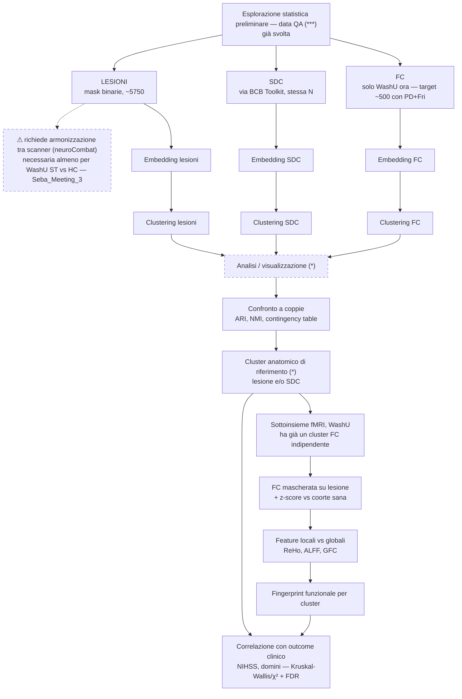

# Domande 

1. **Integrazione multimodale**: come si combinano in un quadro unico i segnali anatomico (lesione), strutturale (SDC), funzionale (FC/FDC) e fisiologico (EEG)? In particolare:
    - come costruire uno spazio (o modello) che integri le modalità invece di trattarle come storie separate;
    - come si sovrappongono/divergono spazialmente e informativamente le diverse modalità tra loro.
2. **Alterazioni canoniche di connettività**: esistono pattern di alterazione della FC ricorrenti e generalizzabili tra pazienti, distinti dalla variabilità idiosincratica del singolo caso?
	- **Fenotipi generalizzabili tra dataset**: i pattern identificati (anatomici e/o funzionali) si riproducono across siti/scanner diversi, o richiedono armonizzazione (es. neuroCombat) per essere confrontabili?
	- **Inferenza anatomia → funzione**: dato un paziente di cui si conosce solo lesione/SDC (senza fMRI), è possibile stimare a quale fenotipo funzionale ("fingerprint") appartiene probabilmente, sulla base del cluster anatomico di appartenenza?
3. **Locale vs. globale**: come si collegano le caratteristiche locali del segnale funzionale alle alterazioni globali dell'organizzazione di rete post-ictus?
	 - **Quale feature locale predice meglio il comportamento?** Tra i candidati: ampiezza del segnale, covarianza, ALFF, Regional Homogeneity (ReHo), media/varianza della Global Functional Connectivity (GFC), e parametri locali in funzione della distanza dalla lesione.


# Basi Letteratura

Le assunzioni di letteratura per Task 1 (lesione→disconnessione, embedding, struttura del
comportamento, dinamica temporale, valore predittivo, clustering di traiettorie...) sono in
`knowledge/nemesis/Papers_Schema.md` (scope per paper) e `Paper_Summaries.md` (dettaglio).


# Cosa possiamo fare noi

## Dati per modalità

| Modalità                                                              | N stimata                          | Dataset coperti                                                                                              | Note                                                         |
| --------------------------------------------------------------------- | ---------------------------------- | ------------------------------------------------------------------------------------------------------------ | ------------------------------------------------------------ |
| Lesioni (mask binarie)                                                | fino a ~5800                       | Washu(200), PASPORT(100), PSP(200), UKLFR(700), Amburgo(500, in arrivo)<br>UCL(4100, da negoziare), Santiago | La N più grande e più eterogenea per sito                    |
| SDC (da lesione via BCB Toolkit)                                      | stessa N delle lesioni disponibili | idem                                                                                                         | Derivata, non richiede dati aggiuntivi oltre la lesione      |
| Feature funzionali (matrici FC)                                       | sottoinsieme, ordine di ~500       | Washu                                                                                                        | Richiede coorte sana di riferimento per costruire le matrici |
| Feature EEG                                                           | ~80                                | Padova                                                                                                       | In arrivo (TBD, settembre/ottobre);                          |
| Dati clinico/comportamentali (tsv: NIHSS + subitem, dati demografici) | variabile per dataset              | tutti quelli con participants.tsv                                                                            | Copertura da verificare dataset per dataset                  |
| Longitudinale                                                         | da definire                        | non chiaro quali dataset abbiano più timepoint, né a quali distanze (2 sett? 3 mesi? 1 anno?)                |                                                              |


##  Workflow possibile



```
(*) Per ogni clustering: mappe su MNI, scatter colorato, overlap con atlanti, radar/spider plot del centroide, matrici FC per cluster.

(***) Fase 0 in dettaglio: percentili di volumetria lesionale (coda dei casi severi),
      mismatch di disponibilità lesione/FC per dataset, curva soglia→pazienti-esclusi per
      il mascheramento FC — dettagli in `workflow.md`.
```

## Tabella riepilogativa per fasi del workflow

Bozza del workflow operativo — ogni step è dettagliato in documentazione e note a parte (`docs/guides/`, `docs/dev/`, `management/notes/workflow.md`).

| Fase                                                                                                            | Metodi candidati                                                                                                                                                                                                                                                                                                                                                                                                                                                                                             | Base fondante                                                                                                                                                                                                                                                                                            | Confronto/replica                                                                                                                                                                | Trampolino di lancio                                                                                                                                                                                                                                                                                                                                                                                                                                                                                                                                                                                                                                                                                                                                   |
| --------------------------------------------------------------------------------------------------------------- | ------------------------------------------------------------------------------------------------------------------------------------------------------------------------------------------------------------------------------------------------------------------------------------------------------------------------------------------------------------------------------------------------------------------------------------------------------------------------------------------------------------ | -------------------------------------------------------------------------------------------------------------------------------------------------------------------------------------------------------------------------------------------------------------------------------------------------------- | -------------------------------------------------------------------------------------------------------------------------------------------------------------------------------- | ------------------------------------------------------------------------------------------------------------------------------------------------------------------------------------------------------------------------------------------------------------------------------------------------------------------------------------------------------------------------------------------------------------------------------------------------------------------------------------------------------------------------------------------------------------------------------------------------------------------------------------------------------------------------------------------------------------------------------------------------------ |
| 0. **Esplorazione statistica preliminare** (data QA)                                                            | - Disponibilità dati (lesione/FC per dataset)<br>- Demografia e clinica (età, sesso, lateralità, punteggi clinici)<br>- Frequenza voxel-wise di lesione sulla coorte<br>- Soglia di mascheramento FC                                                                                                                                                                                                                                                                                                         | —                                                                                                                                                                                                                                                                                                        | —                                                                                                                                                                                | —                                                                                                                                                                                                                                                                                                                                                                                                                                                                                                                                                                                                                                                                                                                                                      |
| 1. **Embedding lesioni** + **clustering** (n~5750)                                                              | **Riduzione:** PCA(varimax) / UMAP / t-SNE, o altri candidati da valutare - su lesioni parcellizzate o voxel-wise<br><br>**Clustering:** k-means, HDBSCAN, agglomerative, GMM, spectral, o altri da letteratura<br><br>**Analisi/viz:** <br>- mappe di frequenza lesione per cluster su MNI (overlap map);<br>- scatter dell'embedding colorato per variabili rilevanti; <br>- overlap % con atlanti; <br>- plot del centroide di cluster (es. radar/spider)                                                 | Thiebaut de Schotten 2020 (lesioni non casuali, seguono la vascolarizzazione → clusterizzano)                                                                                                                                                                                                            | Replicare la PCA varimax di Thiebaut de Schotten (46 componenti, 30 spiegano >90% varianza) sulla nostra N molto più ampia; confrontare i cluster con i territori vascolari noti | Confrontare sistematicamente più combinazioni embedding×clustering alla scala n~5750                                                                                                                                                                                                                                                                                                                                                                                                                                                                                                                                                                                                                                                                   |
| 2. **Embedding SDC** + **clustering**                                                                           | Le lesioni passano già per BCB Toolkit, che produce sia lesione sia SDC parcellizzate per atlante (Stage 2)<br><br>**Riduzione + Clustering:** stessi metodi della fase 1, su SDC parcellizzata<br><br>**Analisi/viz:** stessa della fase 1                                                                                                                                                                                                                                                                  | Griffis 2019/2020 (SDC spiega la disfunzione di rete meglio del danno locale); <br>Salvalaggio 2020 (SDC ≈ lesione come predittore, FDC fallisce)                                                                                                                                                        | Replicare il morfospazio UMAP di Talozzi 2023 sulla nostra coorte, partendo da SDC (come nel paper originale)                                                                    | —                                                                                                                                                                                                                                                                                                                                                                                                                                                                                                                                                                                                                                                                                                                                                      |
| 2b. **Embedding + clustering FC indipendente** (attualmente solo WashU; target futuro ~500 con Padova+Friburgo) | **Dati:** solo WashU disponibile ora<br><br>**Riduzione:** PCA/UMAP, o altri candidati da valutare, su matrice FC statica; autoencoder su dinamica BOLD se le timeseries risultano disponibili<br><br>**Clustering:** k-means, HDBSCAN, agglomerative, GMM, spectral, o altri da letteratura<br><br>**Analisi/viz:** <br>- matrice FC media per cluster e diff vs coorte sana;<br>- riassunto per network Yeo (within/between); feature locali (ReHo/ALFF) su superficie;<br>- composizione per dataset/sito | Idesis 2023 (autoencoder su dinamica BOLD batte PCA lineare, predice recupero a 1 anno)                                                                                                                                                                                                                  | —                                                                                                                                                                                | Definisce un **fenotipo** **funzionale** di riferimento (basato solo su FC), in aggiunta al ruolo descrittivo che la FC ha già in fase 4                                                                                                                                                                                                                                                                                                                                                                                                                                                                                                                                                                                                               |
| 3. **Confronto cluster** lesione vs SDC vs FC                                                                   | **Metriche:** ARI, NMI, contingency table, a coppie (lesione-SDC, lesione-FC, SDC-FC)<br><br>**Analisi/viz:**<br>- contingency table/heatmap cross-modale; <br>- copertura per dataset nell'embedding                                                                                                                                                                                                                                                                                                        | —                                                                                                                                                                                                                                                                                                        | —                                                                                                                                                                                | - Lesioni topograficamente diverse condividono lo stesso streamline disconnesso<br>- Quantificare quanto la SDC comprime cluster lesionali distinti in uno stesso cluster<br>- Quanto lesione/SDC predicono davvero il cluster FC (fenotipi generalizzabili)                                                                                                                                                                                                                                                                                                                                                                                                                                                                                           |
| 4. **Feature funzionali per cluster anatomico** (WashU)                                                         | **Mascheramento FC:** per ogni soggetto, i nodi con copertura di tessuto sano sotto soglia (50%) diventano NaN nella matrice FC invece di essere trattati come intatti — implementato e verificato su tutta la coorte WashU (`mask_fc.py`)                                                                                                                                                                                                                                                                   | Griffis 2019 (PLSC struttura-funzione - giustifica il cluster anatomico come chiave valida per organizzare le alterazioni FC); Santoro 2026 (il fingerprint individuale resta persistentemente diverso dalla norma sana anche a distanza di mesi - giustifica il confronto individuale vs template sano) | Riprodurre l'approccio di Siegel 2016 di mascheramento FC sull'estensione lesionale, applicato alla nostra coorte                                                                | z-score per singolo paziente vs template sano, poi mediato per cluster anatomico: nessun paper della libreria fa esattamente questa combinazione (mascheramento di Siegel + confronto individuale di Santoro, applicati alla scala del cluster anatomico anziché del singolo soggetto o dell'intera coorte) --> per questo è trampolino e non base/confronto                                                                                                                                                                                                                                                                                                                                                                                           |
| 5. **Caratterizzazione fenotipo funzionale** da cluster anatomico                                               | Media delle **feature** **funzionali** (FC/ALFF/ReHo) all'interno di ciascun cluster anatomico                                                                                                                                                                                                                                                                                                                                                                                                               | —                                                                                                                                                                                                                                                                                                        | —                                                                                                                                                                                | Corbetta_Meeting_1: _"fino ad ora il comportamento è stato l'asse per la predizione delle lesioni"_ — il comportamento era il traguardo finale, lesione/SDC/FC gli input per arrivarci (Siegel, Corbetta 2015, Bisogno). <br><br>Qui l'asse si sposta: lesione, SDC e feature funzionali diventano il centro del workflow, e il comportamento passa a valle come validazione (fase 7) invece che essere il traguardo primario. In pratica: sul sottoinsieme con fMRI (fase 4) si costruisce un fingerprint funzionale medio per ciascun cluster anatomico; per un paziente senza dati fMRI propri, il fenotipo funzionale non viene calcolato ma inferito per appartenenza al cluster - gli si assegna il fingerprint medio del suo cluster anatomico. |
| 6. **Feature locali vs. globali** del segnale FC                                                                | ReHo, ALFF, ampiezza/covarianza, media/varianza GFC (catalogo di 50 feature, Volpi 2024/2025)                                                                                                                                                                                                                                                                                                                                                                                                                | Volpi 2024 (ReHo = predittore locale più forte del metabolismo)                                                                                                                                                                                                                                          | Volpi lavora su soggetti sani: da noi sarebbe la prima applicazione del catalogo completo a una coorte stroke                                                                    | Le fasi 4-5 usano la FC solo in modo descrittivo (media/z-score per cluster). Questa fase risponde invece alla domanda di ricerca 3 (locale vs. globale): quale feature locale spiega meglio le alterazioni globali di rete e il comportamento, e come cambia in funzione della distanza dalla lesione — usando il catalogo Volpi come base per costruire predittori locali intra-cluster                                                                                                                                                                                                                                                                                                                                                              |
| 7. **Correlazione con outcome clinico-comportamentale**                                                         | **Metodo:** ridge regression / PCA sui punteggi comportamentali (altri metodi predittivi da valutare una volta validato l'approccio base)<br><br>**Validazione:** test non parametrici + correzione FDR<br><br>**Viz:** boxplot/violin delle variabili cliniche per cluster                                                                                                                                                                                                                                  | Corbetta 2015, Bisogno 2021, Facchini 2023 (struttura a 3 fattori, bassa dimensionalità); Talozzi 2023 (DSD)                                                                                                                                                                                             | Validare i nostri cluster (anatomici/SDC) contro NIHSS e subitem con lo schema statistico di Zanola 2026 (Kruskal-Wallis/χ² + correzione FDR)                                    | Testare sulla nostra coorte la tensione clinica-vs-imaging tra Bisogno 2025 (reti funzionali/strutturali > mappa vascolare) e Cinetto (clinica batte lesione/SDC nella maggior parte dei domini): i cluster anatomici/SDC aggiungono valore incrementale ai soli dati clinico-demografici, o no?                                                                                                                                                                                                                                                                                                                                                                                                                                                       |
| 8. **EEG** (n~80, Padova)                                                                                       | TBD                                                                                                                                                                                                                                                                                                                                                                                                                                                                                                          | —                                                                                                                                                                                                                                                                                                        | —                                                                                                                                                                                | Deferred a settembre/ottobre 2026                                                                                                                                                                                                                                                                                                                                                                                                                                                                                                                                                                                                                                                                                                                      |
